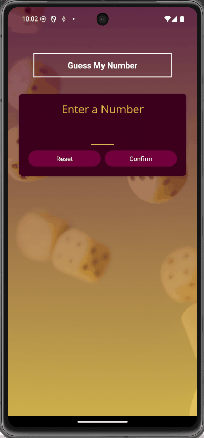

# Guess My Number

## Description

- React Native를 이용하여 제작한 사용자 입력 숫자 추측 게임 앱
- 현재 사용 중인 디바이스가 몇 번만에 사용자가 입력한 숫자를 맞추는지 카운팅하여 보여주는 게임
- 게임 진행 방법
  - 첫 번째 화면에서 디바이스가 알아 맞추게할 정답 번호를 입력한다. (1자리 또는 2자리 숫자)
  - 두 번째 화면에서 디바이스에게 힌트를 주면서 디바이스가 첫 번째 화면에서 입력한 숫자를 추측하도록 한다.
    - 각 라운드마다 디바이스가 추측한 숫자가 정답 보다 작거나 큰지 힌트를 줄 수 있다.
    - 디바이스에게 잘못된 힌트를 줄 경우, 잘못된 힌트를 줬다는 경고 메시지 알림창이 표시된다.
    - 각 진행 상황 정보가 `FlatList` 형태로 하단에 표시된다.

## Development Information

- **Development Period** : 2025.04.06 - 2025.04.11
- **Language** : HTML5, CSS3, JavaScript
- **Library** : React.js
- **Framework** : React Native

## How to Start

> **npm**

```bash
$ npm install
$ npm start
```

> **yarn**

```bash
$ yarn
$ yarn start
```

- 터미널에 위의 명령을 실행한 후,
  - Android 에뮬레이터가 설치되어 있을 경우, `a` 버튼 클릭
  - 웹에서 실행하려면, `w` 버튼 클릭

```text
› Press a │ open Android
› Press w │ open web
```

## Display

<table>
<tr>
  <th colspan="4">Screenshots</th>
</tr>
<tr>
  <td>
    
  </td>
  <td>
    
  </td>
  <td>
    
  </td>
  <td>
    
  </td>
</tr>
</table>
