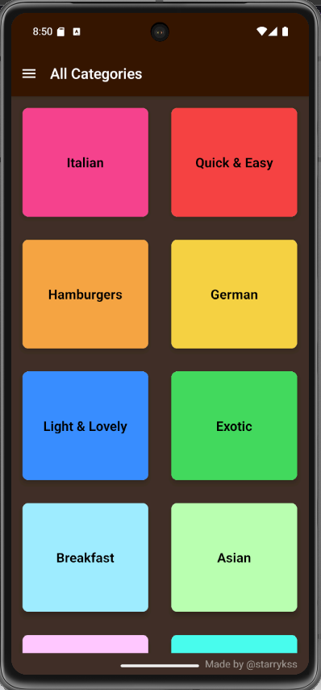
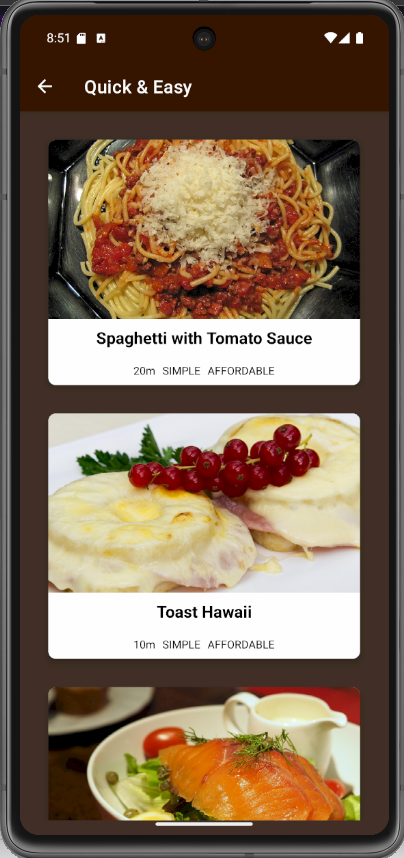
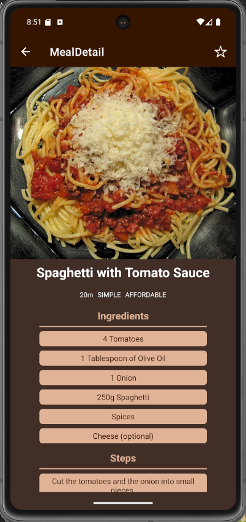
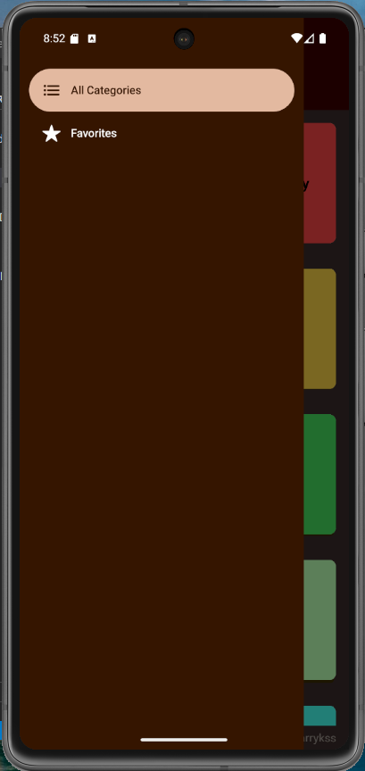
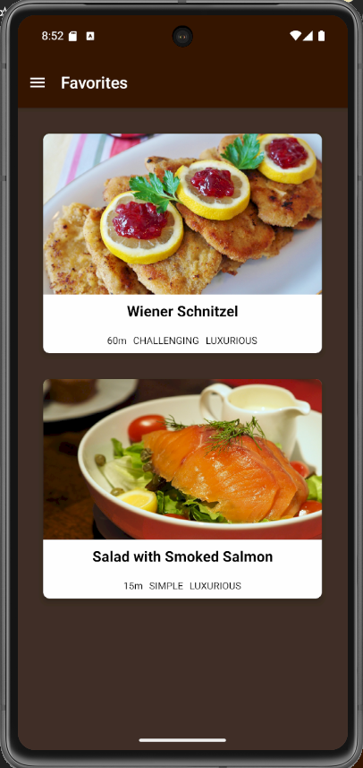

# Simple Recipe

## Description

- React Native를 이용하여 제작한 음식 레시피 확인 앱
- 카테고리별로 여러가지 음식의 레시피를 확인할 수 있다.
- 즐겨찾기 기능을 지원하여, 특정 레시피를 즐겨찾기에 추가 및 해제할 수 있으며, 즐겨찾기 추가한 음식 레시피들을 즐겨찾기 화면에서 확인할 수 있다.
- **[React Navigation](https://reactnavigation.org/) 라이브러리** 를 이용하여 Drawer Navigation, Stack Navigation 기능을 구현하였다.
- **Redux** 를 이용하여 전역 상태 관리 기능을 구현하였다. (레시피 즐겨찾기 기능)
  - **Context API** 를 이용한 전역 상태 관리 관련 코드도 포함하었다. (주석 처리 또는 미사용)

## Development Information

- **Development Period** : 2025.05.06 - 2025.05.13
- **Language** : HTML5, CSS3, JavaScript
- **Library** : React.js, Redux, React Navigation
- **Framework** : React Native

## How to Start

> **npm**

```bash
$ npm install
$ npm start
```

> **yarn**

```bash
$ yarn
$ yarn start
```

- 터미널에 위의 명령을 실행한 후,
  - Android 에뮬레이터가 설치되어 있을 경우, `a` 버튼 클릭
  - 웹에서 실행하려면, `w` 버튼 클릭

```text
› Press a │ open Android
› Press w │ open web
```

## Display

<table>
  <tr>
    <th colspan="3">Screenshots</th>
  </tr>
  <tr>
    <td>
      
    </td>
    <td>
      
    </td>
    <td>
      
    </td>
  </tr>
  <tr>
    <td>
      
    </td>
    <td>
      
    </td>
    <td>
      
    </td>
  </tr>
</table>
