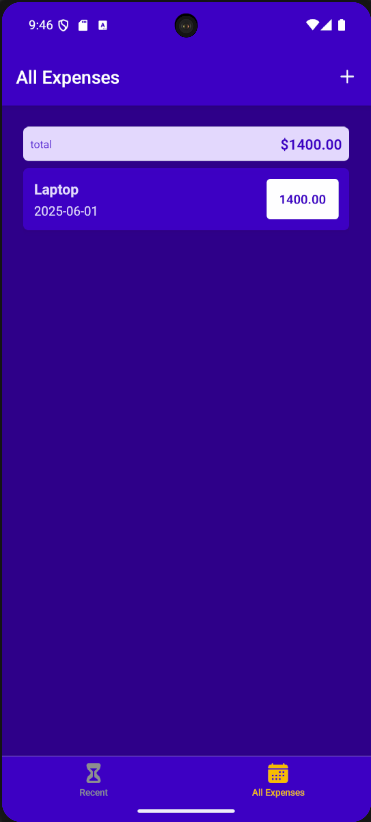

# Expense Tracker

## Description

- React Native를 이용하여 제작한 지출 내역 정리 앱
- 지출 내역을 추가하거나 수정 또는 삭제할 수 있다.
- 2가지 방법을 이용하여 지출 내역이 저장되도록 기능을 구현하였다.
  - **Context API** : 지출 내역 로컬 저장 (전역 상태 관리)
  - **Firebase** : 지출 내역 서버 저장 (지출 내역 동기화)
- **[React Navigation](https://reactnavigation.org/) 라이브러리** 를 이용하여 Bottom Tabs Navigation, Stack Navigation 기능을 구현하였다.

## Development Information

- **Development Period** : 2025.05.29 - 2025.06.07
- **Language** : HTML5, CSS3, JavaScript
- **Library** : React.js, React Navigation
- **Framework** : React Native
- **Cloud Platform** : Firebase

## Hot to Configure (Before Start)

- 프로젝트의 원할한 구동을 위해서는 자신이 Firebase 엔드포인트와 연동을 해줘야 한다.
- 프로젝트 최상단 경로(`/`)에 `.env` 파일을 생성한 후, 아래의 내용을 넣어준다.

```bash
BACKEND_URL=YOUR_FIREBASE_ENDPOINT     # 본인의 Firebase 엔드포인트를 넣어준다.
```

## How to Start

> **npm**

```bash
$ npm install
$ npm start
```

> **yarn**

```bash
$ yarn
$ yarn start
```

- 터미널에 위의 명령을 실행한 후,
  - Android 에뮬레이터가 설치되어 있을 경우, `a` 버튼 클릭
  - 웹에서 실행하려면, `w` 버튼 클릭

```text
› Press a │ open Android
› Press w │ open web
```

## Display

<table>
  <tr>
    <th colspan="3">Screenshots</th>
  </tr>
  <tr>
    <td>
      
    </td>
    <td>
      
    </td>
    <td>
      
    </td>
  </tr>
</table>
