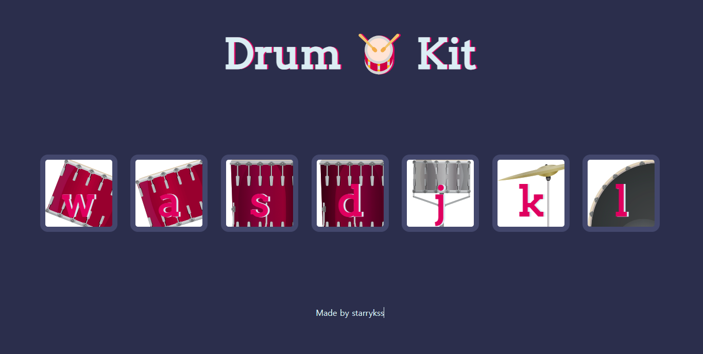

# Drum Kit

## Description

- HTML5, CSS3, JavaScript를 공부하면서 간단하게 만들어본 드럼 연주 사이트
- 악기 연주 방법
  - 연주하고 싶은 부분을 마우스로 클릭한다.
  - 키보드의 `[W]`, `[A]`, `[S]`, `[D]`, `[J]`, `[K]`, `[L]` 키를 누른다.

### Drum Kit

- 일반적으로 드러머가 사용하는 여러 가지 드럼과 퍼커션 악기의 집합
- 드럼 키트는 **베이스 드럼(Bass Drum), 스네어 드럼(Snare Drum), 톰-톰(Tom-Toms), 하이햇(Hi-Hat),크래시 심볼(Crash Cymbal), 라이드 심볼(Ride Cymbal),페달 및 하드웨어** 로 구성된다.

## Development Information

- **Development Period** : 2023.11.03
- **Language** : HTML, CSS3, JavaScript

## Demo

▶️ [Click](https://starrykss.github.io/Experiments/DrumKit/index.html)

## Display

