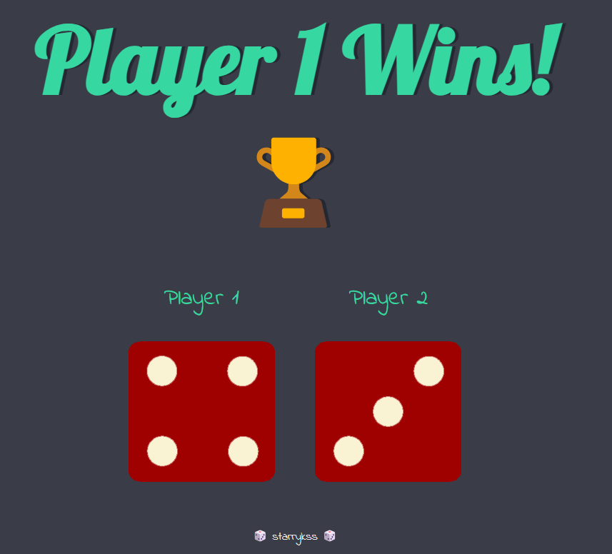
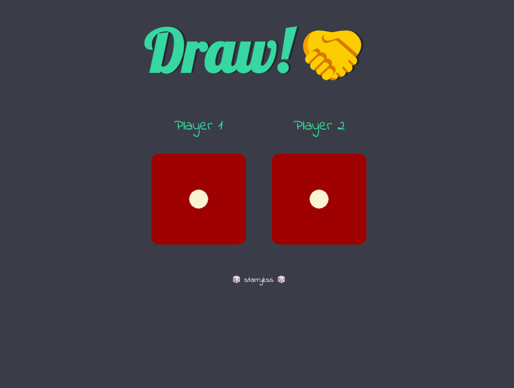
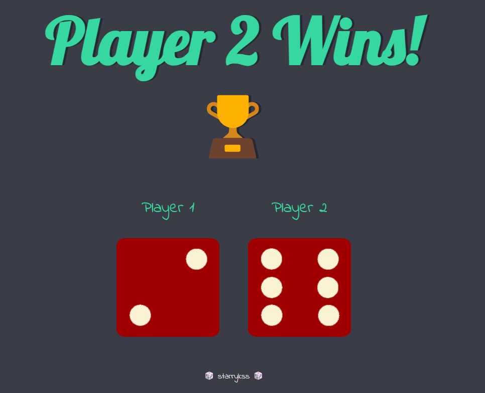

# Dice Challenge

## Description

- 새로고침(`[F5]`)을 할 때마다 Player 1과 Player 2의 주사위 숫자가 랜덤으로 나타난다.
- 주사위 수가 더 큰 Player가 승리하며, 주사위 수가 같게 나오면 비기게 된다.

## Development Information

- **Development Period** : 2023.11.04
- **Language** : HTML, CSS3, JavaScript

## Demo

▶️ [Click](https://starrykss.github.io/Experiments/DiceChallenge/index.html)

## Display

|              Player 1 WIN              |                  DRAW                  |              Player 2 WIN              |
| :------------------------------------: | :------------------------------------: | :------------------------------------: |
|  |  |  |
