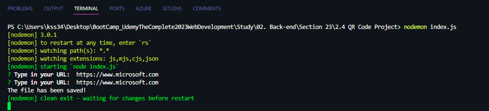
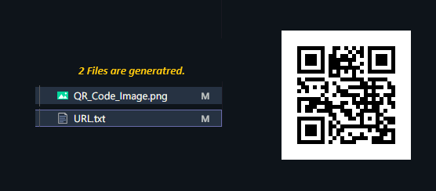

# QR Code Generator

## Description

- QR 코드 이미지 생성기
- URL을 입력하면, 해당 URL에 접속할 수 있는 QR 코드 이미지를 생성해준다.

## Development Information

- **Development Period** : 2023.11.07
- **Language** : HTML5, CSS3, JavaScript
- **Runtime Environment** : Node.js
  - **Packages**
    - [`qr-image`](https://www.npmjs.com/package/qr-image)
    - [`inquirer`](https://www.npmjs.com/package/inquirer)

## How to Start

- `src` 폴더에 진입한 후, 터미널에서 `npm install` 명령을 실행한다. (필요한 패키지 설치)
- `node index` 명령을 실행하여 QR 코드로 만들 URL을 입력한다.
- `The file has been saved!`가 출력되고, **2개** 의 파일이 생성된다.
  - `URL.txt` 입력했던 URL이 담긴 파일
  - `QR_Code_Image.png` : 해당 URL에 접속할 수 있는 QR 코드 이미지 파일

## Display

|              Screenshot 1              |              Screenshot 2              |
| :------------------------------------: | :------------------------------------: |
|  |  |
