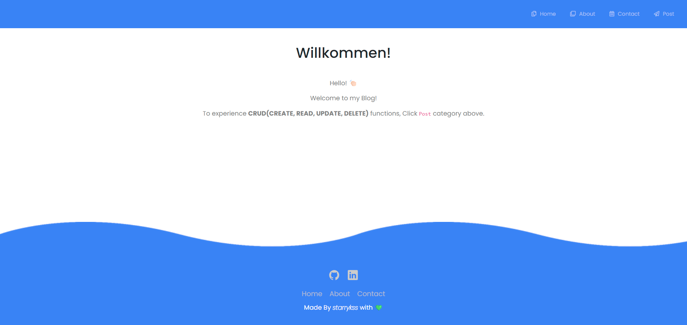
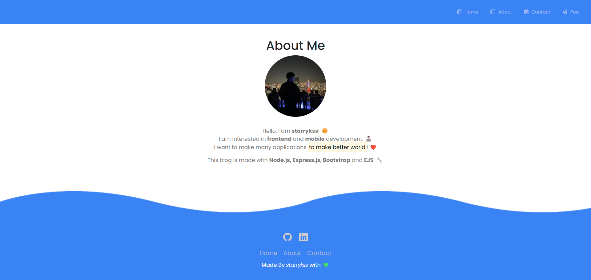
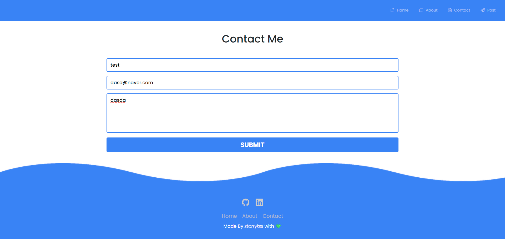
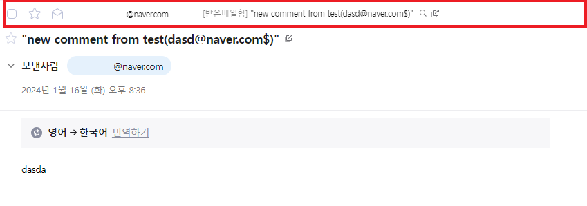
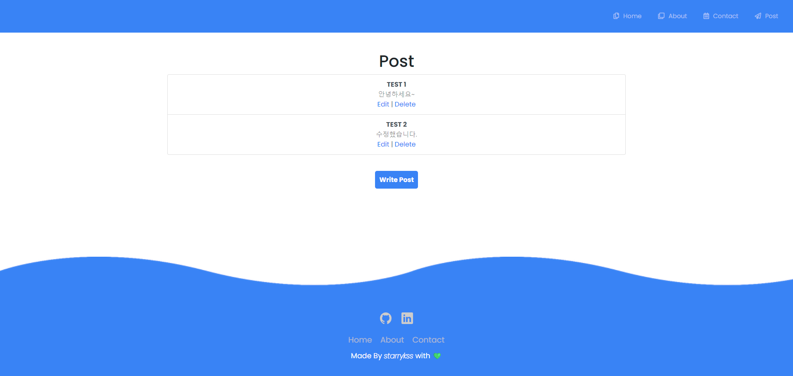

# My Simple Blog

## Description

- **CRUD(CREATE, READ, UPDATE, DELETE)** 기능을 적용한 나만의 블로그
  - CRUD 기능
    - 게시판에 글 남기기(`CREATE`)
    - 게시판에서 올린 글 보기(`READ`)
    - 게시판에 올린 글 수정하기(`UPDATE`)
    - 게시판에 올린 글 삭제하기(`DELETE`)
  - 이메일 보내기 기능
    - `Contact` 게시판에서 내용을 입력하고 전송(`SUBMIT`) 버튼을 누르면, 해당 내용과 정보가 호스트의 이메일 계정으로 보내진다.

## Development Information

- **Development Period** : 2023.11.10
- **Language** : HTML5, CSS3, JavaScript, Bootstrap
- **Runtime Environment** : Node.js
  - **Packages**
    - [`ejs`](https://www.npmjs.com/package/ejs)
    - [`express`](https://www.npmjs.com/package/express)
    - [`nodemailer`](https://www.npmjs.com/package/nodemailer)
    - [`body-parser`](https://www.npmjs.com/package/body-parser)

## How to Start

- `src` 폴더에 진입한 후, 터미널에서 `npm install` 명령을 실행한다. (필요한 패키지 설치)
- `node index` 명령을 실행하여 서버를 시작한다.
- `localhost:3000`에 접속한다.

## Display

<table>
  <tr>
    <th>Screenshot 1</th>
    <th>Screenshot 2</th>
  </tr>
  <tr>
    <td></td>
    <td></td>
  </tr>
    <tr>
    <th>Screenshot 3</th>
    <th>Screenshot 4</th>
  </tr>
  <tr>
    <td> </td>
    <td></td>
  </tr>
</table>
