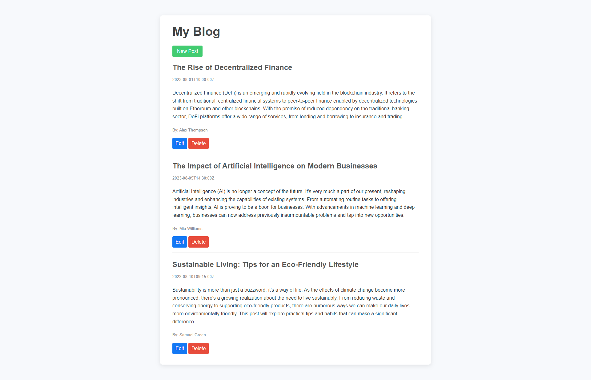
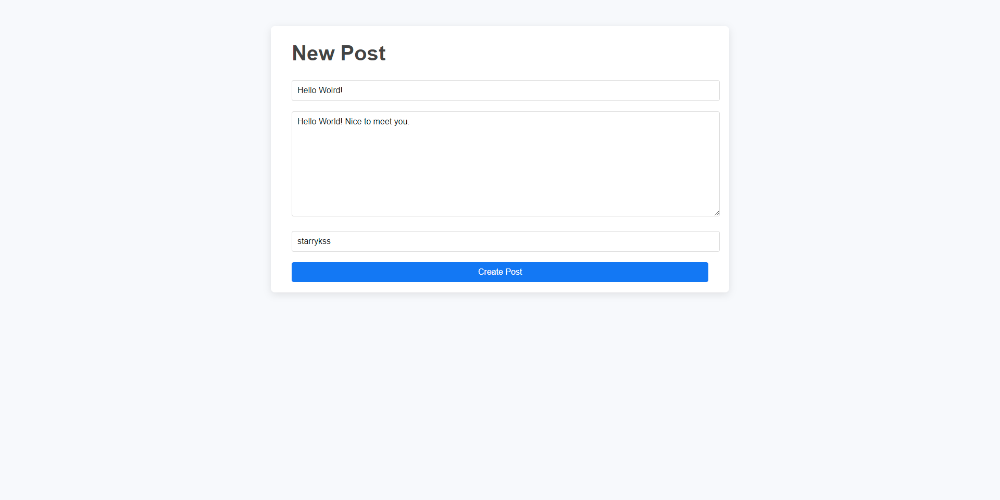
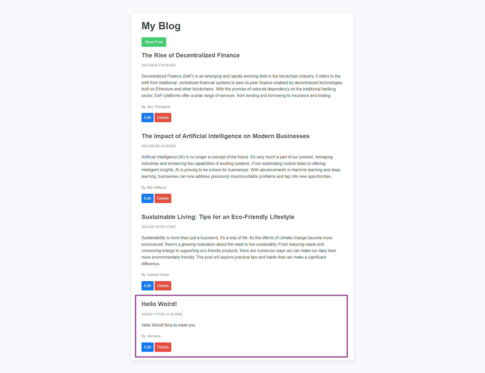

# Simple CRUD Blog with API

## Description

- API를 이용하여 CRUD 기능을 구현한 블로그
  - **글 불러오기** : `GET`
  - **글 작성하기** : `POST`
  - **글 수정하기** : `PATCH`
  - **글 삭제하기** : `DELETE`

## Development Information

- **Development Period** : 2023.11.16
- **Language** : HTML5, CSS3, JavaScript, Bootstrap
- **Runtime Environment** : Node.js
  - **Packages**
    - [`express`](https://www.npmjs.com/package/express)
    - [`ejs`](https://www.npmjs.com/package/ejs)
    - [`axios`](https://www.npmjs.com/package/axios)
    - [`body-parser`](https://www.npmjs.com/package/body-parser)

## How to Start

- `src` 폴더에 진입한 후, 터미널에서 `npm install` 명령을 실행한다. (필요한 패키지 설치)
- `node index` 명령을 실행하여 프론트 서버를 시작한다.
- `node server` 명령을 실행하여 백엔드 서버를 시작한다.
- `localhost:3000`에 접속한다.

## Display

|              Screenshot 1              |                            Screenshot 2                            |              Screenshot 3              |
| :------------------------------------: | :----------------------------------------------------------------: | :------------------------------------: |
|  |    _글을 추가 하는 모습_ |  |
