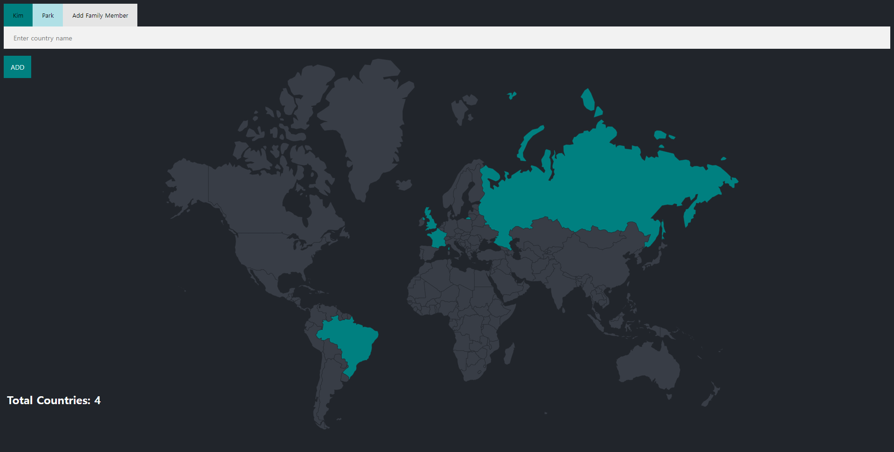
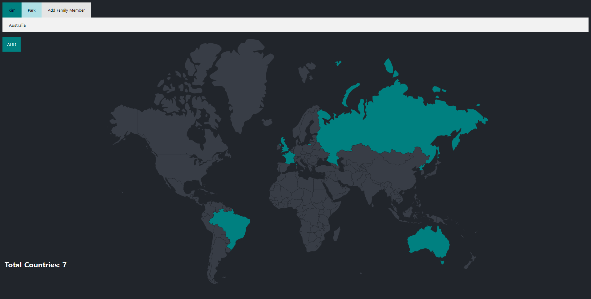
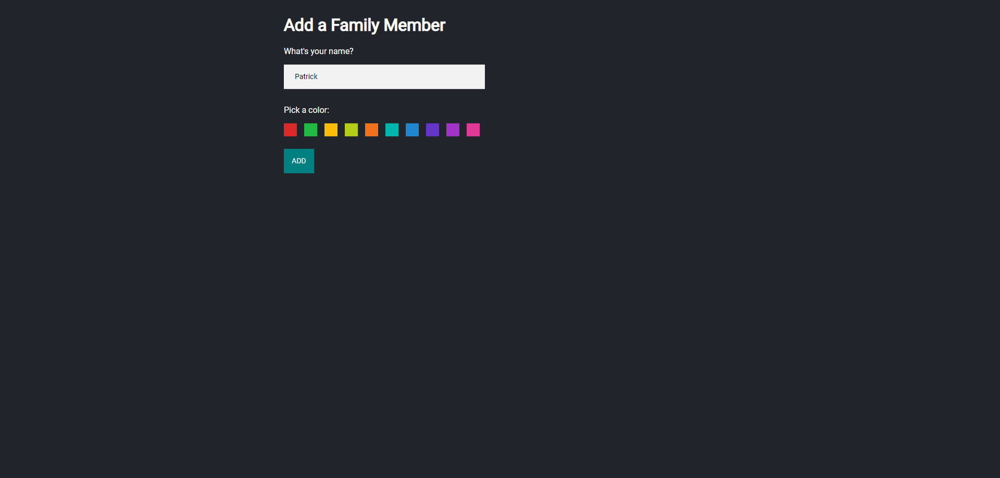
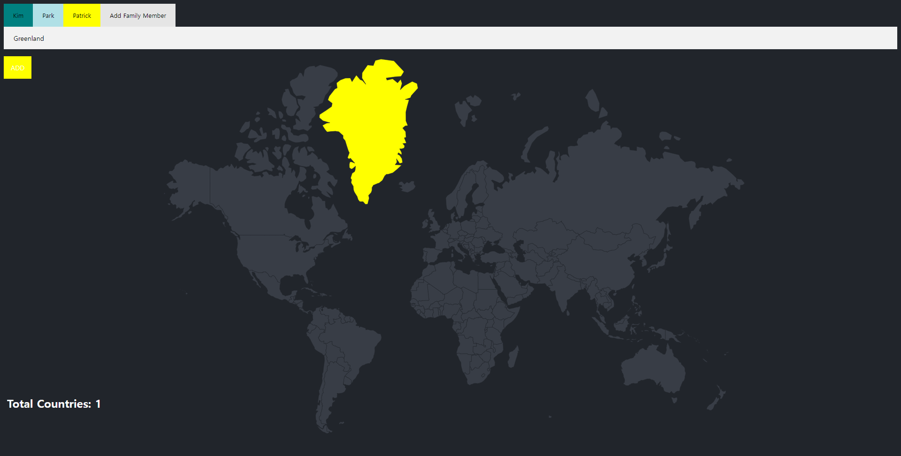

# Family Travel Tracker

## Description

- 가족들이 여행했던 국가들을 입력하여 추가할 수 있는 사이트
- 새로운 가족 구성원을 추가할 수 있다.
- 입력한 정보들은 DB에 저장되어 다음에 사이트에 접속할 때 자동으로 불러와진다.

## Development Information

- **Development Period** : 2023.11.17
- **Language** : HTML5, CSS3, JavaScript
- **Database** : PostgreSQL
- **Runtime Environment** : Node.js
  - **Packages**
    - [`express`](https://www.npmjs.com/package/express)
    - [`ejs`](https://www.npmjs.com/package/ejs)
    - [`body-parser`](https://www.npmjs.com/package/body-parser)
    - [`pg`](https://www.npmjs.com/package/pg)

## How to Start

- `src` 폴더에 진입한 후, 터미널에서 `npm install` 명령을 실행한다. (필요한 패키지 설치)
- PostgreSQL을 PC에 [**설치**](https://www.postgresql.org/download/)하고 다음과 같이 새로운 데이터베이스를 생성한다.

  - `user` : `postgres`
  - `host` : `localhost`
  - `database` : `world`
  - `password` : `12345`
  - `port` : `5432`

- `node index` 명령을 실행하여 서버를 시작한다.
- `localhost:3000`에 접속한다.

## Display

<table>
  <tr>
    <th>Screenshot 1</th>
    <th>Screenshot 2</th>
  </tr>
  <tr>
    <td></td>
    <td></td>
  </tr>
    <tr>
    <th>Screenshot 3</th>
    <th>Screenshot 4</th>
  </tr>
  <tr>
    <td> <i>새로운 가족 구성원을 추가하는 모습</i></td>
    <td></td>
  </tr>
</table>
