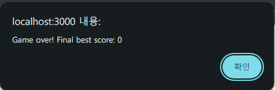
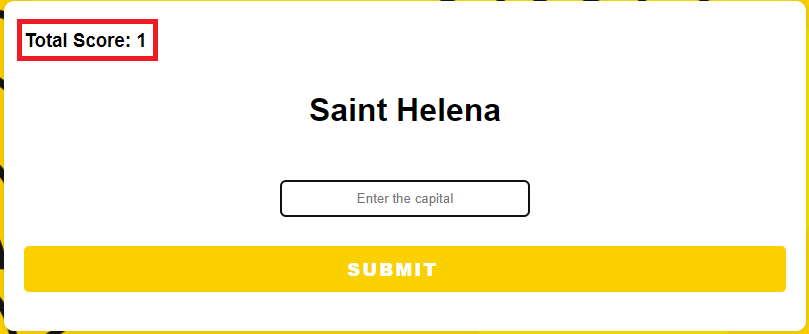

# World Capital Quiz

## Description

- 국가 수도 알아 맞추기 게임
- 국가의 이름(또는 이미지)가 제시되면, 해당 국가의 수도를 영문으로 입력한 후 제출한다.
  - 맞으면 스코어를 획득하고, 틀리면 지금까지 획득했던 스코어를 출력되고 게임이 종료된다.
- 두 가지 버전이 있다.
  - **버전1(`V1`)** : 텍스트 버전
  - **버전2(`V2`)** : 이모지 버전

## Development Information

- **Development Period** : 2023.11.17
- **Language** : HTML5, CSS3, JavaScript
- **Database** : PostgreSQL
- **Runtime Environment** : Node.js
  - **Packages**
    - [`express`](https://www.npmjs.com/package/express)
    - [`ejs`](https://www.npmjs.com/package/ejs)
    - [`body-parser`](https://www.npmjs.com/package/body-parser)
    - [`pg`](https://www.npmjs.com/package/pg)

## How to Start

- `src` 폴더 안에서 원하는 버전의 디렉터리에 진입한 후, 터미널에서 `npm install` 명령을 실행한다. (필요한 패키지 설치)
- PostgreSQL을 PC에 [**설치**](https://www.postgresql.org/download/)하고 다음과 같이 새로운 데이터베이스를 생성한다.

  - `user` : `postgres`
  - `host` : `localhost`
  - `database` : `world`
  - `password` : `12345`
  - `port` : `5432`

- 생성한 데이터베이스(`world`)에 `capitals.csv` 또는 `flags.csv` 파일 안의 내용을 넣어준다.

  - `pgAdmin` 프로그램을 이용하여 손쉽게 불러올 수 있다.

- `node index` 명령을 실행하여 서버를 시작한다.
- `localhost:3000`에 접속한다.

## Display

|                                    Screenshot 1                                    |                                                                                                       Screenshot 2                                                                                                       |
| :--------------------------------------------------------------------------------: | :----------------------------------------------------------------------------------------------------------------------------------------------------------------------------------------------------------------------: |
|    |    <i>수도 이름을 잘못 맞췄을 경우 (스코어 출력 및 종료)</i>        <i>수도 이름을 맞췄을 경우 (스코어 획득)</i> |
