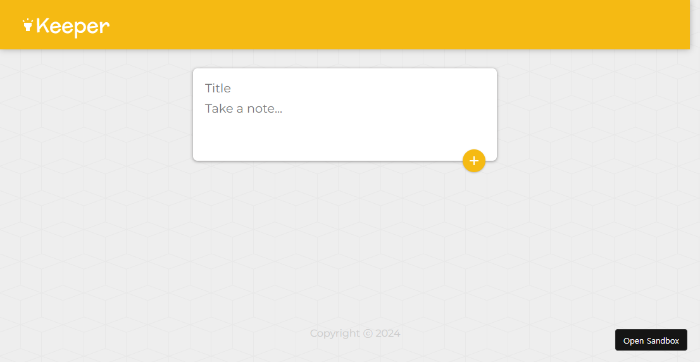
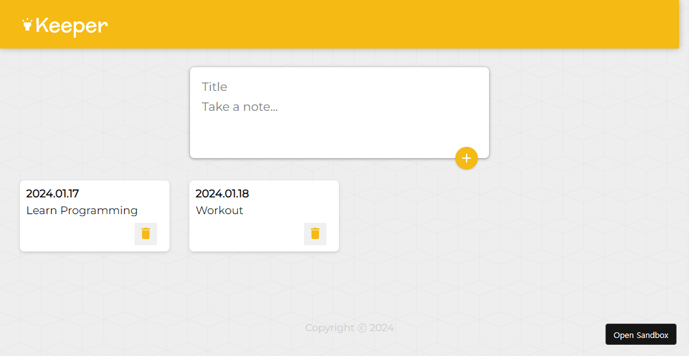

# Keeper

## Description

- 리액트를 이용하여 간단하게 만든 TO DO LIST
- 새로운 메모를 추가하거나 삭제할 수 있다.

## Development Information

- **Development Period** : 2023.12.14
- **Language** : HTML5, CSS3, JavaScript
- **Library** : React.js
- **Runtime Environment** : Node.js

## Demo

▶️ [Click](https://codesandbox.io/p/sandbox/using-pre-built-react-components-completed-forked-kncq9l)

## Display

|              Screenshot 1              |                                 Screenshot 2                                  |
| :------------------------------------: | :---------------------------------------------------------------------------: |
|  |    <i>새로운 항목을 추가한 모습</i> |
