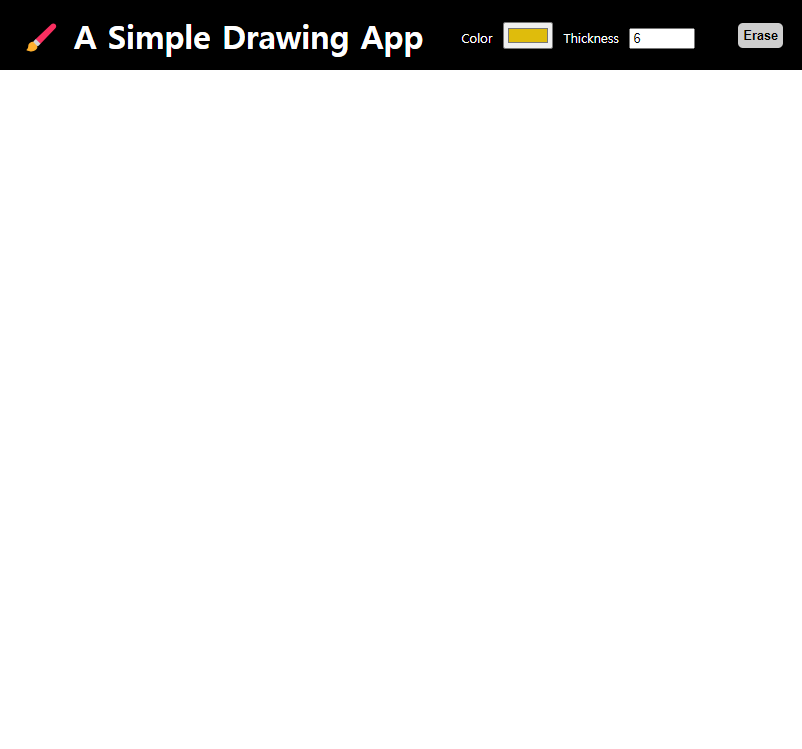
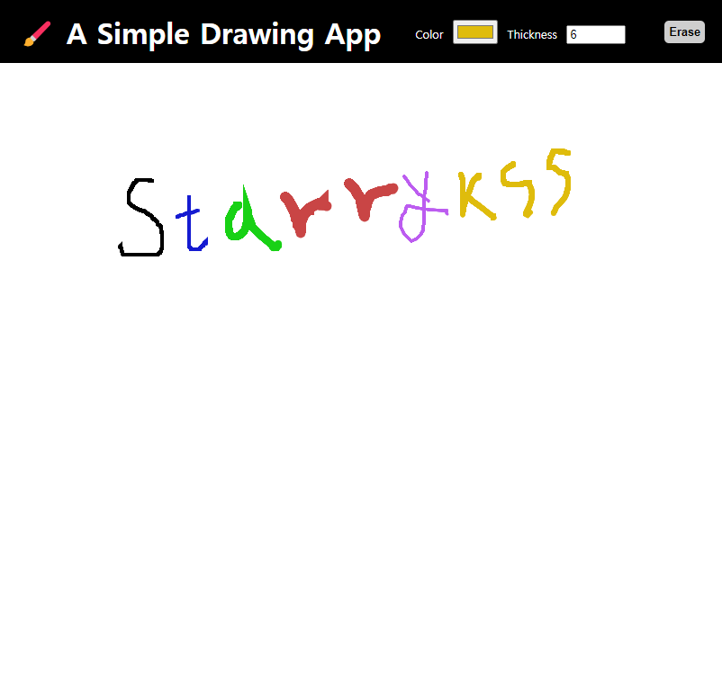

# A Simple Drawing App

## Description

- HTML 캔버스(Canvas) 요소를 이용하여 간단하게 만들어본 드로잉 앱
- 펜의 색상(Color)과 굵기(Thickness)를 지정하여 그림을 그리거나 지울 수 있다.

## Development Information

- **Development Period** : 2024.01.28
- **Language** : HTML5, CSS3, JavaScript

## Demo

▶️ [Click](https://starrykss.github.io/Experiments/SimpleDrawingApp/index.html)

## Display

|              Screenshot 1              |              Screenshot 2              |
| :------------------------------------: | :------------------------------------: |
|  |  |
