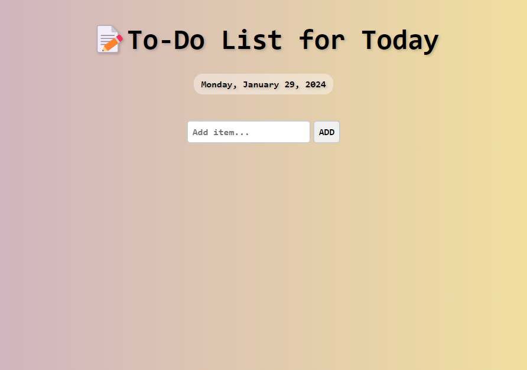
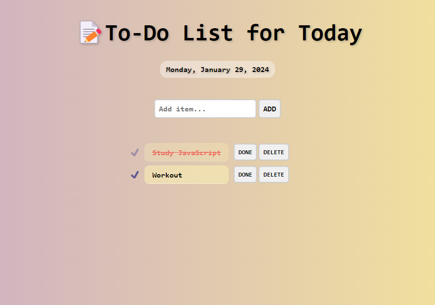

# A Simple To-Do List

## Description

- **웹 스토리지(Web Storage)** 를 이용하여 제작한 간단한 TO DO LIST
  - 페이지를 새로고침해도 기존에 추가했던 내용들이 그대로 남아 있다.
- 해야할 일 항목을 추가하고 완료 표시를 할 수 있으며, 삭제할 수 있다.

## Development Information

- **Development Period** : 2024.01.29
- **Language** : HTML5, CSS3, JavaScript

## Demo

▶️ [Click](https://starrykss.github.io/Experiments/SimpleToDoList/index.html)

## Display

|              Screenshot 1              |              Screenshot 2              |
| :------------------------------------: | :------------------------------------: |
|  |  |
