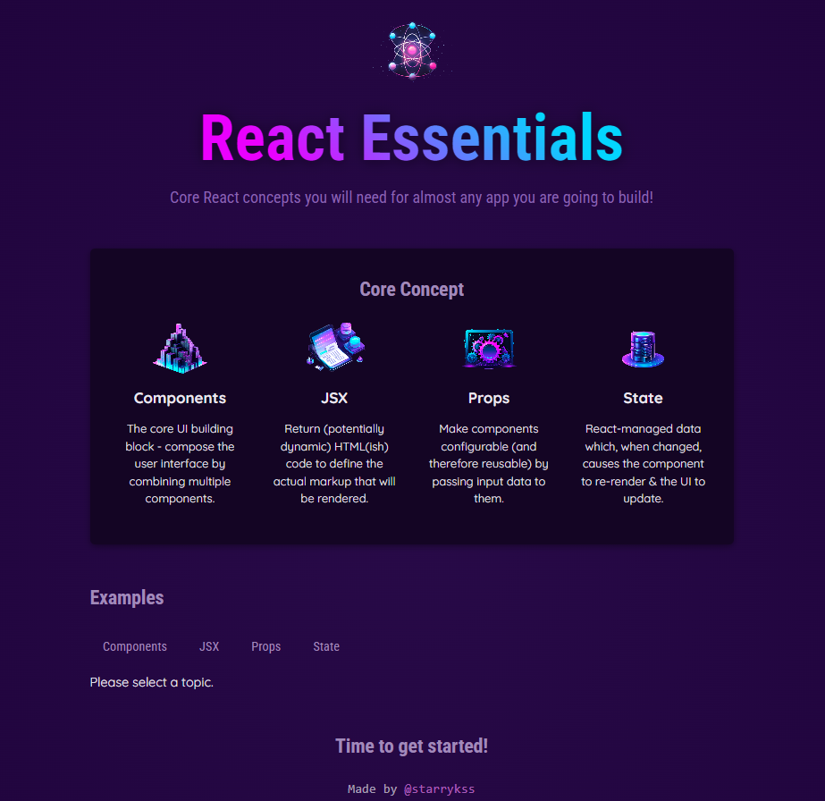
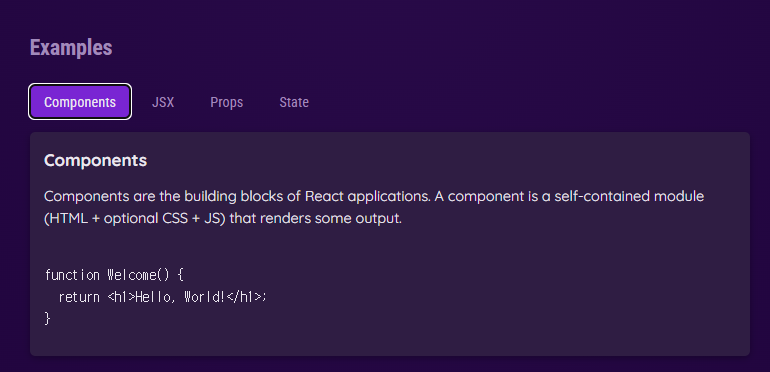

# React Essentials

## Description

- 리액트를 공부하면서 학습한 리액트(React.js)의 필수 기능들을 이용하여 만들어본 간단한 페이지
  - Component, JSX(JavaScript eXtension), Props, State

## Development Information

- **Development Period** : 2024.05.14
- **Language** : HTML5, CSS3, JavaScript
- **Library** : React.js

## How to Start

> `yarn`

```bash
$ yarn
$ yarn dev
```

> `npm`

```bash
$ npm install
$ npm run dev
```

## Display

|              Screenshot 1              |              Screenshot 2              |
| :------------------------------------: | :------------------------------------: |
|  |  |
