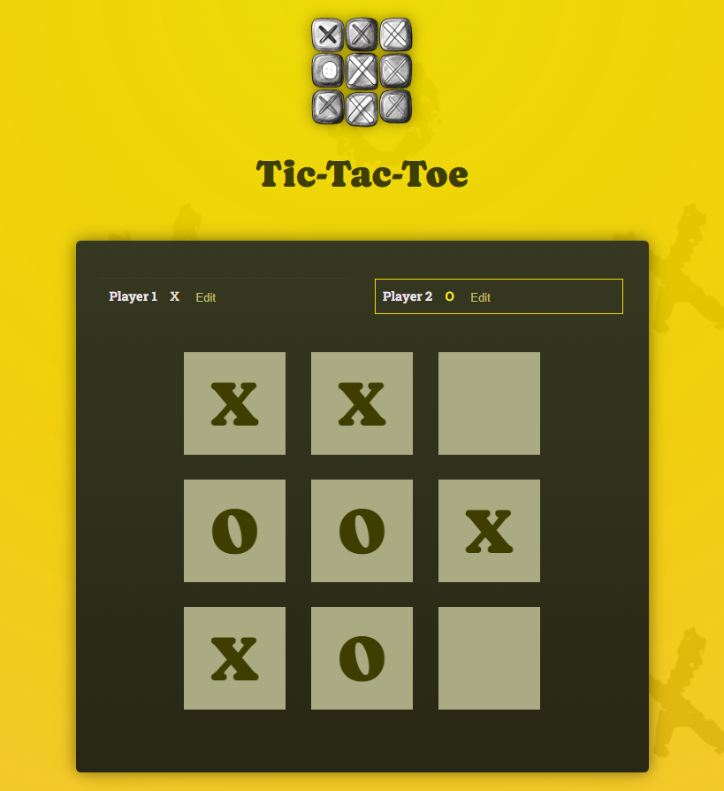
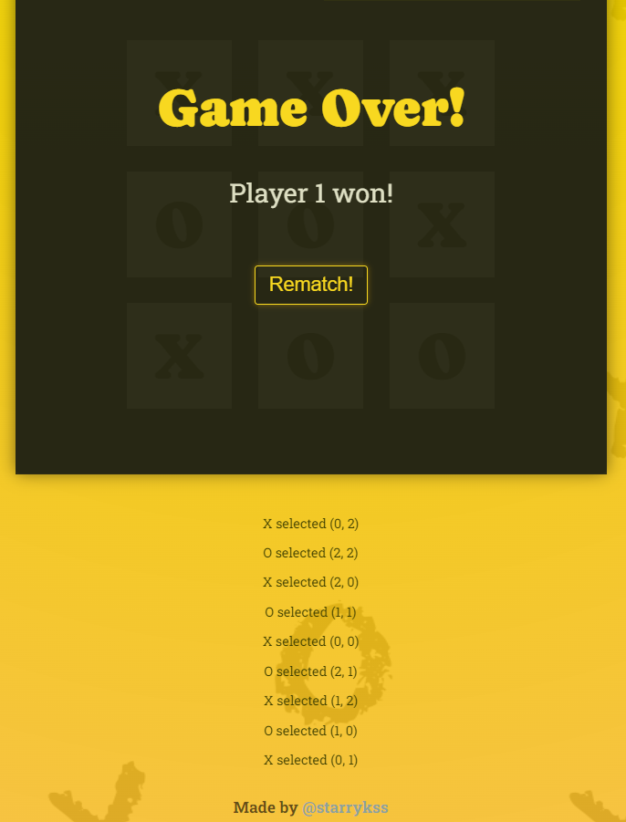

# Tic-Tac-Toe

## Description

- 리액트(React.js)를 공부하면서 학습한 리액트의 필수 기능들을 이용하여 만들어본 간단한 페이지
  - Component, JSX(JavaScript eXtension), Props, State
- `Player 1`과 `Player 2`의 이름을 변경할 수 있다.
- 3×3 크기의 버튼 중 하나를 클릭하면, 로그가 컨테이너 밑에 표시된다.

## Development Information

- **Development Period** : 2024.05.15
- **Language** : HTML5, CSS3, JavaScript
- **Library** : React.js

## How to Start

> **yarn**

```bash
$ yarn
$ yarn dev
```

> **npm**

```bash
$ npm install
$ npm run dev
```

## Display

|              Screenshot 1              |              Screenshot 2              |              Screenshot 3              |
| :------------------------------------: | :------------------------------------: | :------------------------------------: |
|  |  |  |
