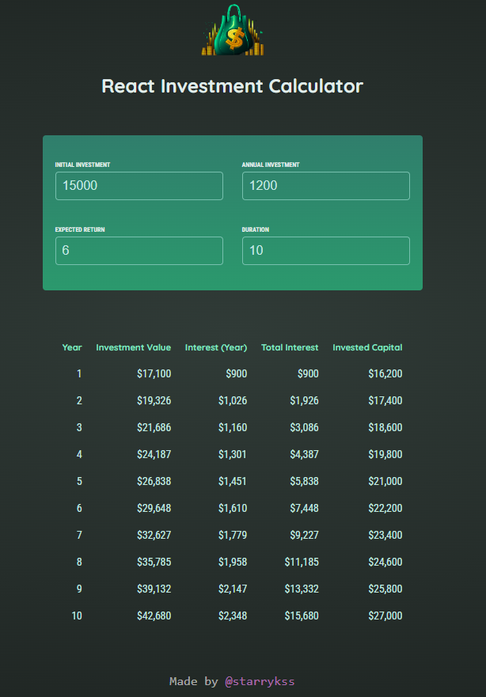
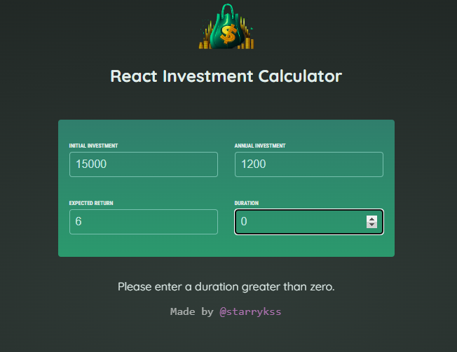

# Investment Calculator

## Description

- 리액트를 공부하면서 학습한 리액트(React.js)의 기본 기능들을 이용하여 만들어본 투자 계산기
  - Component, JSX(JavaScript eXtension), Props, State
- **초기 투자금(`INITIAL INVESTMENT`), 연간 투자금(`ANNUAL INVESTMENT`), 기대 수익(`EXPECTED RETURN`), 투자 지속 기간(`DURATION`)** 을 입력하면, 밑에 테이블이 생성되어 입력한 투자 지속 기간(`DURATION`) 까지의 매년 **투자금 가치(`Investment Value`), 이자(`Interest`), 총 투자 금액(`Total Capital`)** 등을 확인할 수 있다.
- 투자 지속 기간(`DURATION`)의 값은 1 이상의 숫자만 입력될 수 있다.

## Development Information

- **Development Period** : 2024.05.16
- **Language** : HTML5, CSS3, JavaScript
- **Library** : React.js

## How to Start

> yarn

```bash
$ yarn
$ yarn dev
```

> npm

```bash
$ npm install
$ npm run dev
```

## Display

|              Screenshot 1              |              Screenshot 2              |
| :------------------------------------: | :------------------------------------: |
|  |  |
