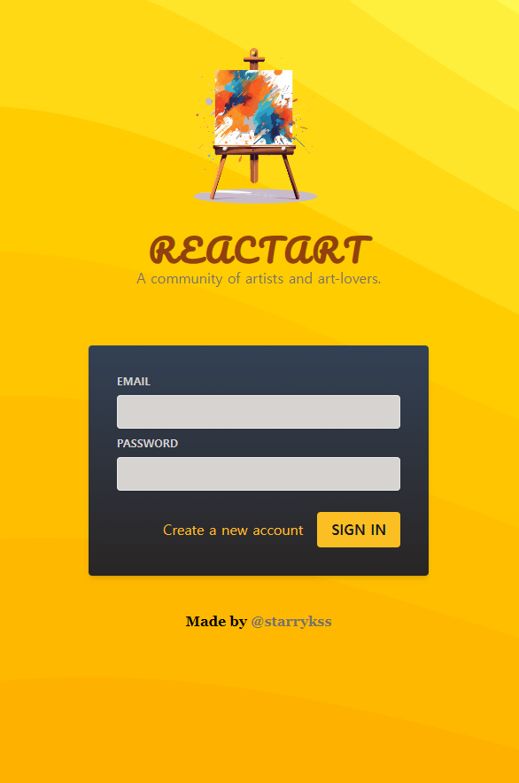
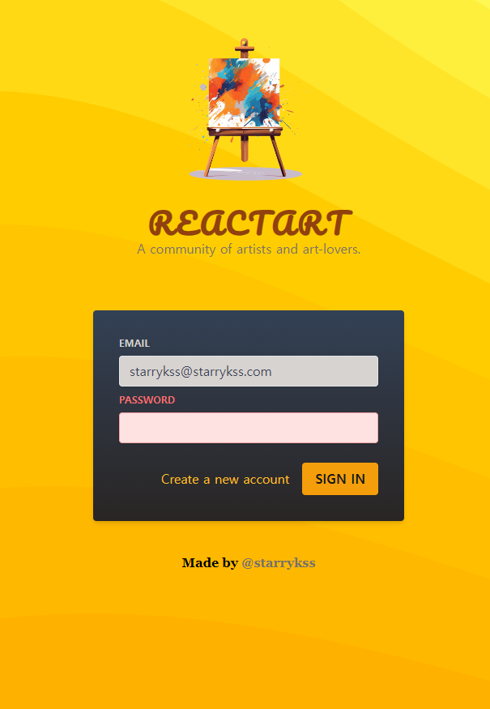

# Simple Login UI 1

## Description

- 리액트(React.js)를 공부하면서 학습한 리액트의 기본 기능과 Tailwind CSS를 이용하여 만들어본 간단한 로그인 UI 화면
- 이메일 또는 패스워드 `<input>` 요소에 내용을 입력하지 않고 `[SIGN IN]` 버튼을 누를 경우, 해당 `<input>`과 `<label>`에 빨간색 스타일이 적용된다.

## Development Information

- **Development Period** : 2024.05.18
- **Language** : HTML5, CSS3, JavaScript
- **Library** : React.js
- **Framework** : Tailwind CSS

## How to Start

> **yarn**

```bash
$ yarn
$ yarn dev
```

> **npm**

```bash
$ npm install
$ npm run dev
```

## Display

|              Screenshot 1              |              Screenshot 2              |
| :------------------------------------: | :------------------------------------: |
|  |  |
