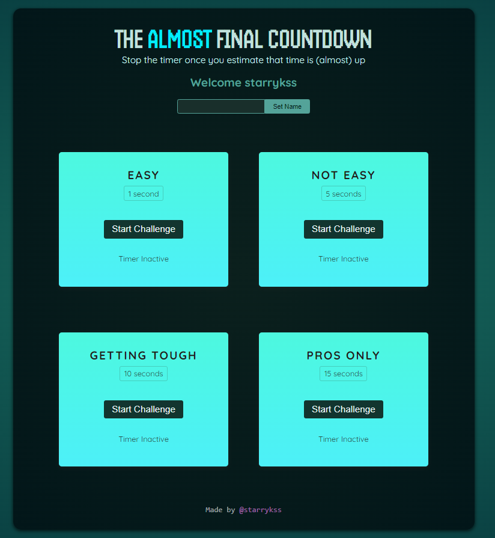
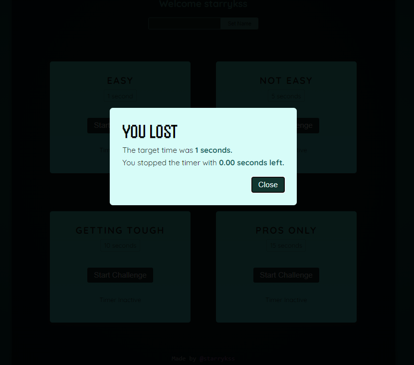
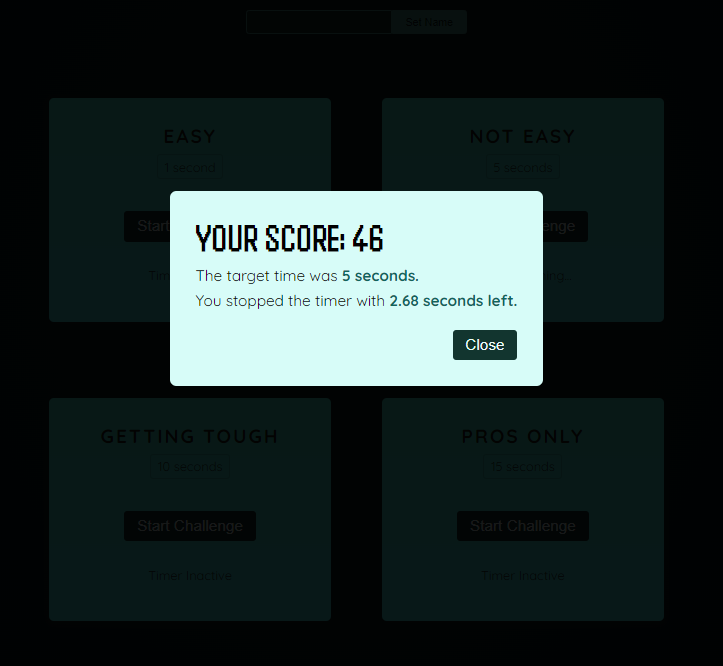

# The Almost Final Countdown

## Description

- 리액트(React.js)를 공부하면서 학습한 리액트의 기능들을 이용하여 만들어본 카운트 다운 맞추기 앱
  - `forwardRef`, `useImperativeHandle`, `useRef`, `useState`, `createPortal` 등

## Development Information

- **Development Period** : 2024.05.21
- **Language** : HTML5, CSS3, JavaScript
- **Library** : React.js

## How to Start

- 우선 플레이어 이름을 설정한다.
- 원하는 카운트 다운 모듈에서 `[Start Challenge]` 버튼을 클릭하고, 어림 잡아 해당 목표 시간(1초, 5초, 10초, 15초)이 되었다고 생각할 때에 `[Stop Challenge]` 버튼을 클릭한다.
- 점수(`score`)를 확인한다.
  - 카운트 다운 숫자에 더 정확하게 근접할수록 더 큰 점수를 얻는다.

> **yarn**

```bash
$ yarn
$ yarn dev
```

> **npm**

```bash
$ npm install
$ npm run dev
```

## Display

|              Screenshot 1              |              Screenshot 2              |              Screenshot 3              |
| :------------------------------------: | :------------------------------------: | :------------------------------------: |
|  |  |  |
