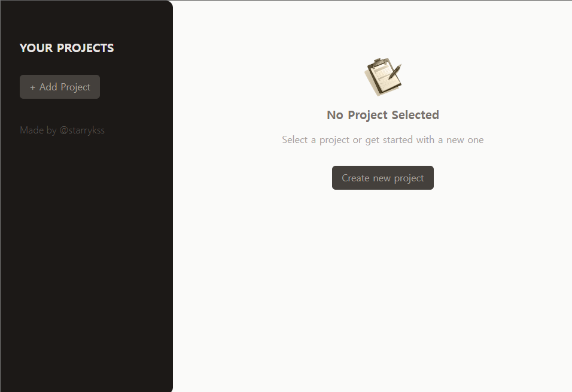
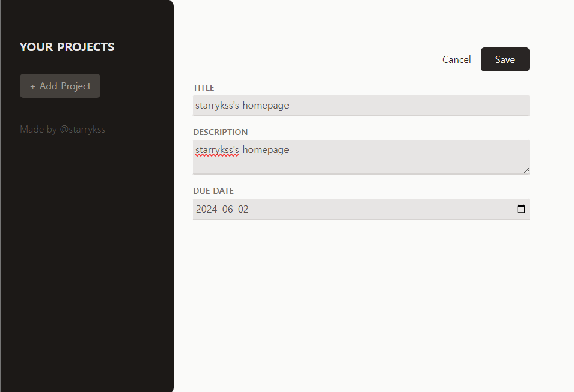
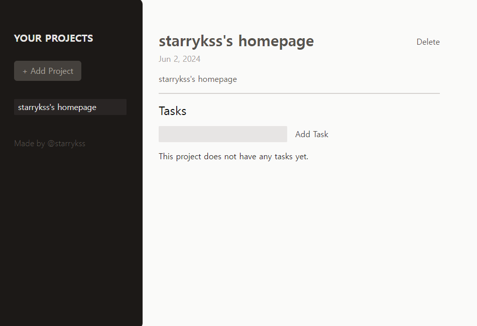
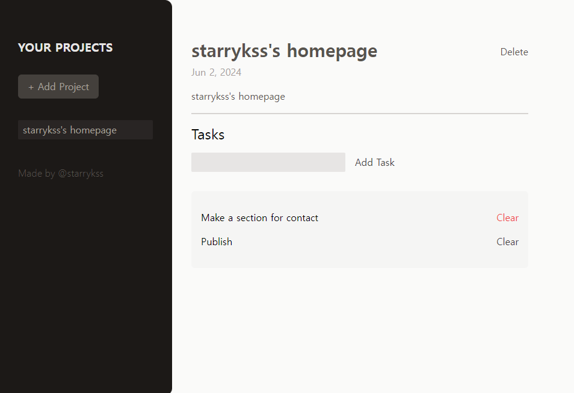

# A Simple Project Archive Page

## Description

- 리액트(React.js)와 Tailwind CSS를 이용하여 간단하게 만들어본 프로젝트 기록 페이지
- 기능
  - 프로젝트 추가
    - 제목(`TITLE`)
    - 설명(`DESCRIPTION`)
    - 날짜(`DUE DATE`)
  - 추가한 프로젝트 확인
  - 프로젝트 별 세부 작업(`TASK`) 추가 및 삭제

## Development Information

- **Development Period** : 2024.06.02
- **Language** : HTML5, CSS3, JavaScript
- **Library** : React.js
- **Framework** : Tailwind CSS

## How to Start

> **yarn**

```bash
$ yarn
$ yarn dev
```

> **npm**

```bash
$ npm install
$ npm run dev
```

## Display

|              Screenshot 1              |              Screenshot 2              |              Screenshot 3              |              Screenshot 4              |
| :------------------------------------: | :------------------------------------: | :------------------------------------: | :------------------------------------: |
|  |  |  |  |
