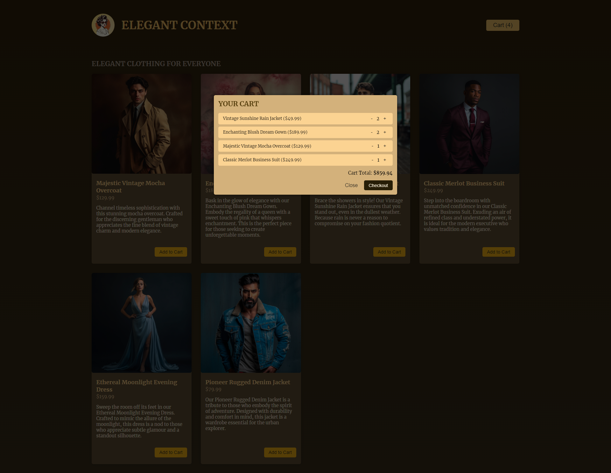

# A Simple Online Shop

## Description

- 리액트(React.js)의 `useContext`, `useReducer`를 이용하여 간단하게 제작한 온라인 쇼핑 사이트
- 기능
  - 장바구니 담기
  - 장바구니 확인
  - 장바구니 내용 수정

## Development Information

- **Development Period** : 2024.06.06
- **Language** : HTML5, CSS3, JavaScript
- **Library** : React.js

## How to Start

> **yarn**

```bash
$ yarn
$ yarn dev
```

> **npm**

```bash
$ npm install
$ npm run dev
```

## Display

|              Screenshot 1              |              Screenshot 2              |
| :------------------------------------: | :------------------------------------: |
|  |  |
