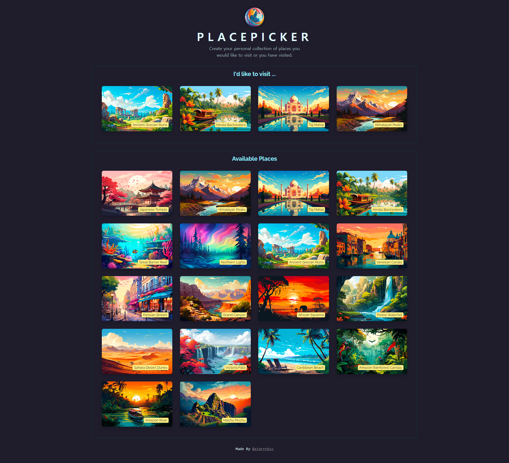
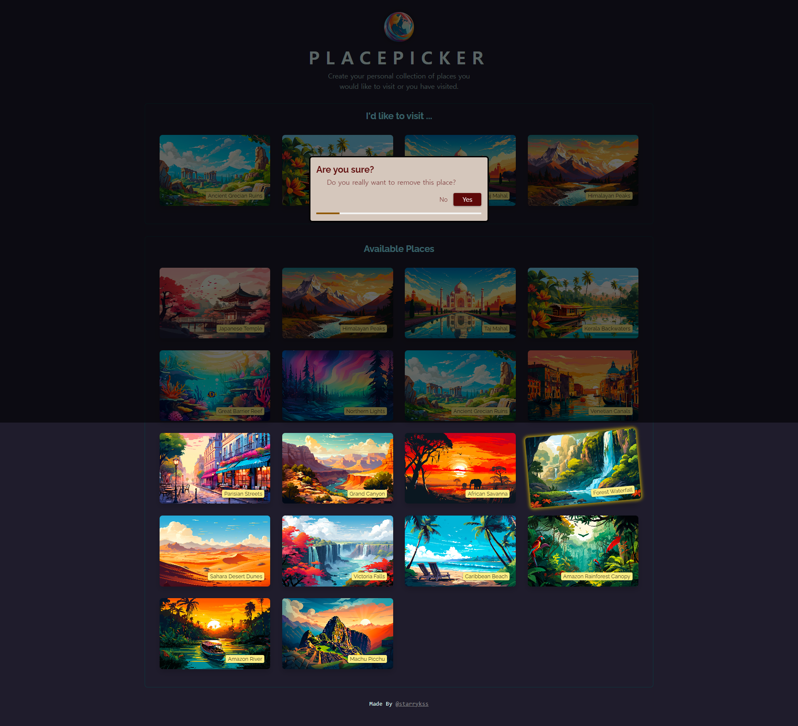

# Place Picker

## Description

- 리액트(React.js)로 제작한 여행 명소 고르기 사이트
  - `data1` : `useEffect`, `useCallback` 등을 이용하여 간단하게 제작
  - `data2` : 백엔드와 프론트엔드로 분리하였고, 커스텀 훅 사용하여 제작
- HTML의 `geolocation` API를 이용하여 현재 사이트에 접속한 위치에서 가까운 명소 순으로 정렬하여 보여지도록 구현
- 여행 명소 카드를 클릭하면, `I'd like to visit ...` 섹션에 추가되고, 해당 섹션 안의 카드를 클릭하면 요소 삭제 가능 (삭제 버튼을 누르지 않을 경우, 3초 뒤 자동 삭제)
- **로컬 스토리지(Local Storage)** 기능을 이용하여 페이지가 새로고침 되더라도 추가되거나 삭제된 카드가 페이지에 반영 되도록 구현
- 기능
  - 현재 접속 위치에서 제일 가까운 순으로 여행 명소 표시
  - 여행 명소 카드 추가/삭제 (로컬 스토리지를 이용한 저장 업데이트 내용 저장 및 반영)

## Development Information

- **Development Period** : 2024.06.24, 2024.06.26
- **Language** : HTML5, CSS3, JavaScript
- **Library** : React.js

## How to Start

### 💾 `data1`

> **yarn**

```bash
$ yarn
$ yarn dev
```

> **npm**

```bash
$ npm install
$ npm run dev
```

### 💾 `data2`

> **yarn**

- 백엔드 서버 켜기

```bash
$ cd backend
$ yarn
$ node app.js
```

- 프론트엔드 서버 켜기

```bash
$ yarn
$ yarn dev
```

> **npm**

- 백엔드 서버 켜기

```bash
$ cd backend
$ npm install
$ node app.js
```

- 프론트엔드 서버 켜기

```bash
$ npm install
$ npm run dev
```

## Display

|              Screenshot 1              |              Screenshot 2              |
| :------------------------------------: | :------------------------------------: |
|  |  |
