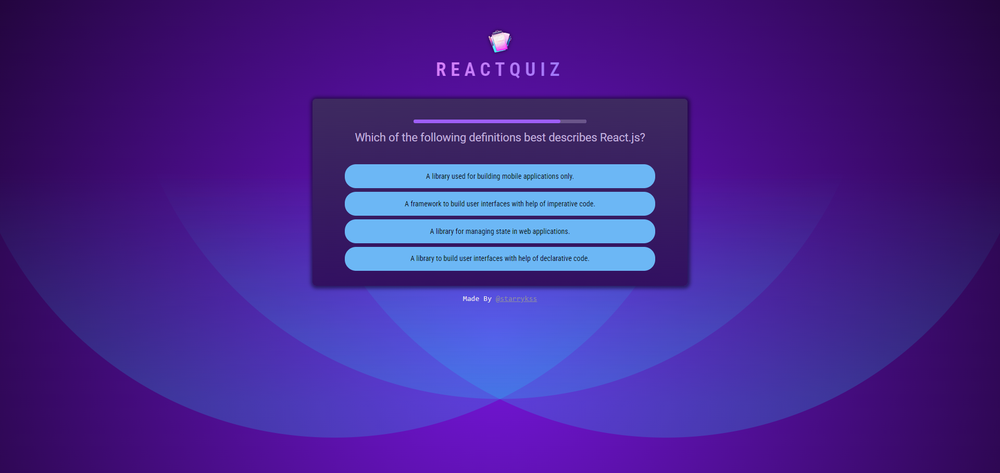
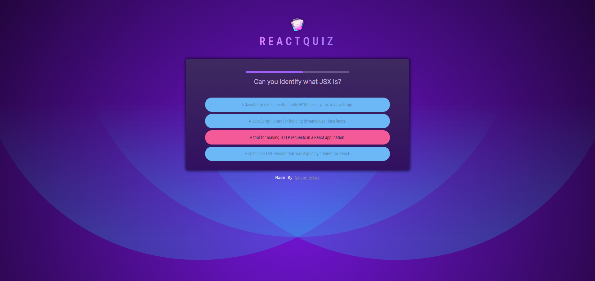
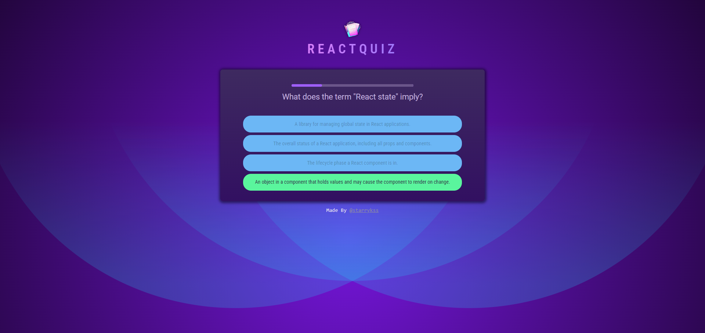
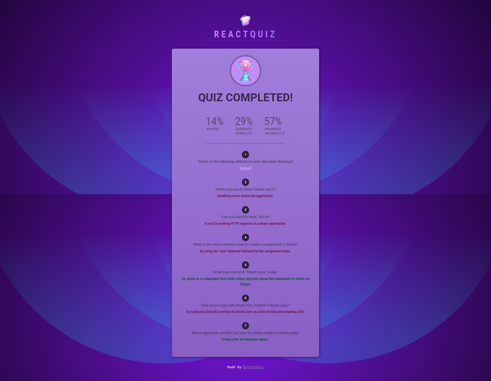

# React Quiz

## Description

- 리액트(React.js)의 기본적인 훅들을 이용하여 만들어본 리액트 상식 퀴즈 앱
- 기능
  - 퀴즈 문제 풀기, 건너뛰기
  - 모든 퀴즈를 풀고난 후 요약 정보 확인

## Development Information

- **Development Period** : 2024.06.25
- **Language** : HTML5, CSS3, JavaScript
- **Library** : React.js

## How to Start

> **yarn**

```bash
$ yarn
$ yarn dev
```

> **npm**

```bash
$ npm install
$ npm run dev
```

## Display

| Screenshot 1 | Screenshot 2 | Screenshot 3 | Screenshot 4 |
| :------------------------------------: | :------------------------------------: || :------------------------------------: || :------------------------------------: |
|  |  |  |  |
