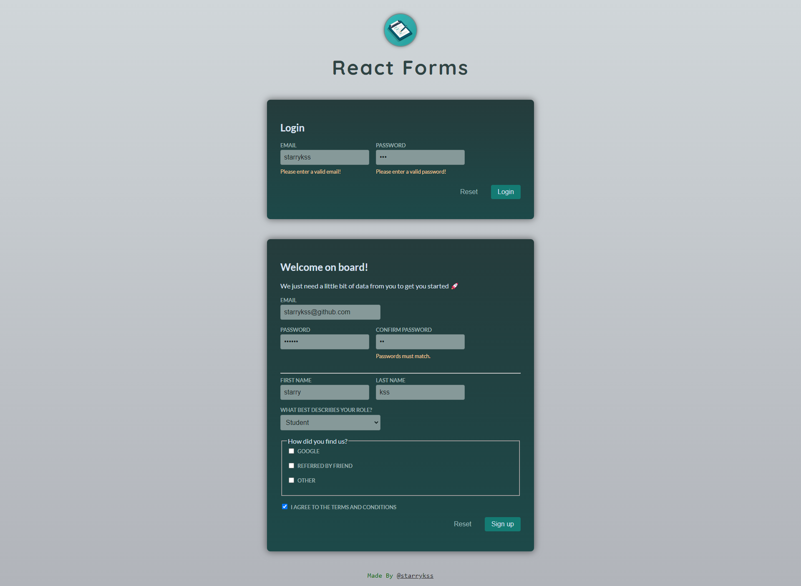
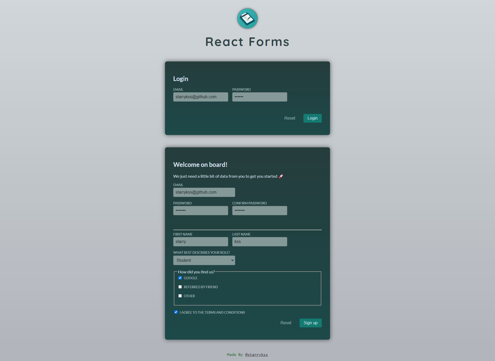

# React Forms

## Description

- 리액트(React.js)의 기본적인 긴으을 이용하여 간단하게 제작한 로그인, 회원가입 폼
- 커스텀 컴포넌트와 커스텀 훅(`useInput`)을 제작하여 최대한 모듈화를 하고자 하였다.
- 기능
  - `useState`를 이용하여 구현한 로그인 폼
  - `FormData`를 이용하여 구현한 회원가입 폼
  - 검증(Validation) 기능 (아이디, 로그인 등)

## Development Information

- **Development Period** : 2024.06.27
- **Language** : HTML5, CSS3, JavaScript
- **Library** : React.js

## How to Start

> **yarn**

```bash
$ yarn
$ yarn dev
```

> **npm**

```bash
$ npm install
$ npm run dev
```

## Display

|              Screenshot 1              |              Screenshot 2              |
| :------------------------------------: | :------------------------------------: |
|  |  |
