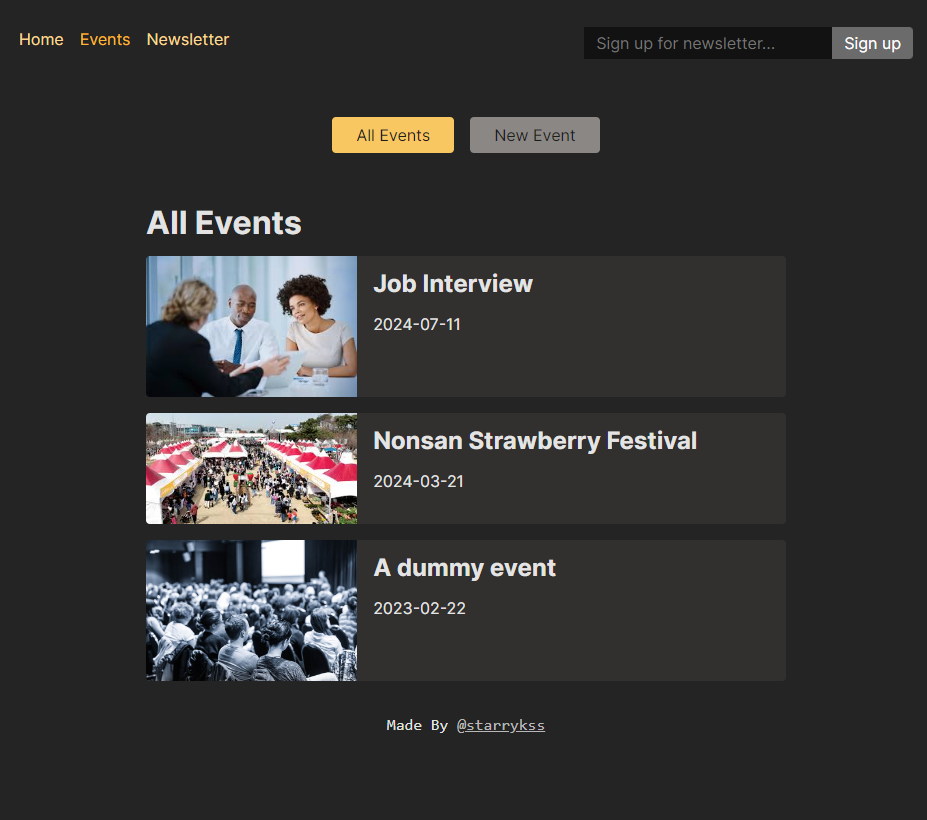
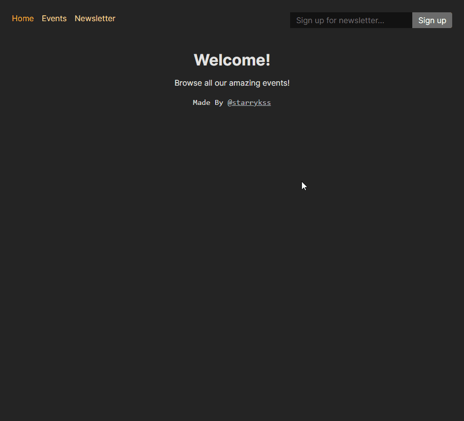

# A Simple Event Browser

## Description

- 리액트 라우터(React Router)를 공부하면서 간단하게 제작해본 이벤트 공고 사이트
  - 라우트를 일반적으로 구성하는 방법
  - 서로 다른 경로에 대해 다른 컴포넌트를 로드하는 방법
  - 오류를 처리하는 방법
  - 여러 경로를 감싸는 레이아웃을 설정하는 방법 (중첩 라우트)
  - 데이터 가져오기와 전송 방법
    - **로더(Loader)** 와 **액션(Action)** 을 사용하여 데이터를 가져오고 제출하는 방법
    - 페이지 이동 없이 데이터를 가져오거나 로드할 수 있는 `useFetcher`를 사용하는 방법
    - 데이터 가져오기를 지연시키는 방법
- 백엔드 서버와 프론트엔드 서버 사이의 통신 기능을 이용하여 이벤트를 추가/편집/삭제할 수 있도록 구현
- 기능
  - 이벤트 추가/편집/삭제 기능

## Development Information

- **Development Period** : 2024.07.07
- **Language** : HTML5, CSS3, JavaScript
- **Library** : React.js, React Router

## How to Start

> **yarn**

- 백엔드 서버 켜기

```bash
$ cd backend
$ yarn
$ node app.js
```

- 프론트엔드 서버 켜기

```bash
$ yarn
$ yarn start
```

## Display

<table>
<tr>
  <th>Screenshot 1</th>
  <th>Screenshot 2</th>
</tr>
<tr>
  <td></td>
  <td></td>
</tr>
</table>s
