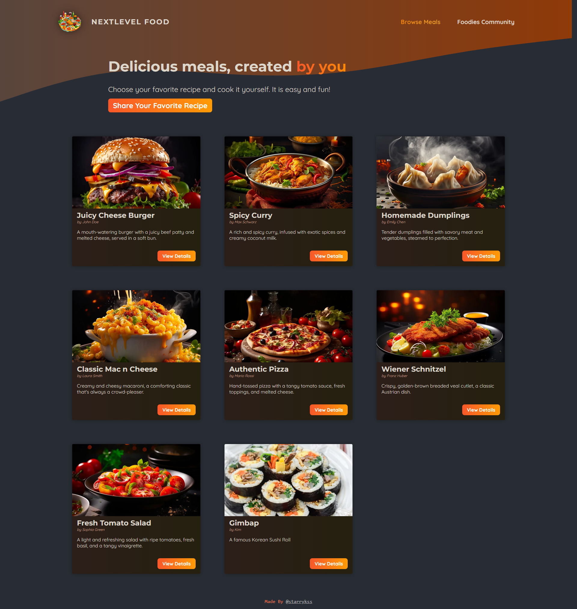

# A Simple Food Recipe Share Platform

## Description

- Next.js를 공부하면서 만들어본 음식 레시피 공유 플랫폼
- Next.js를 이용하여 풀스택(Full Stack) 애플리케이션 형태로 제작
- 기능
  - 음식 레시피 공유 및 확인

## Development Information

- **Development Period** : 2024.08.06
- **Language** : HTML5, CSS3, JavaScript
- **Library** : React.js
- **Framework** : Next.js
- **Database** : SQLite3

## How to Start

> **yarn**

```bash
$ yarn dev
```

> **npm**

```bash
$ npm run dev
```

## Display

<table>
<tr>
  <th>Screenshot 1</th>
  <th>Screenshot 2</th>
</tr>
<tr>
  <td></td>
  <td></td>
</tr>
</table>
