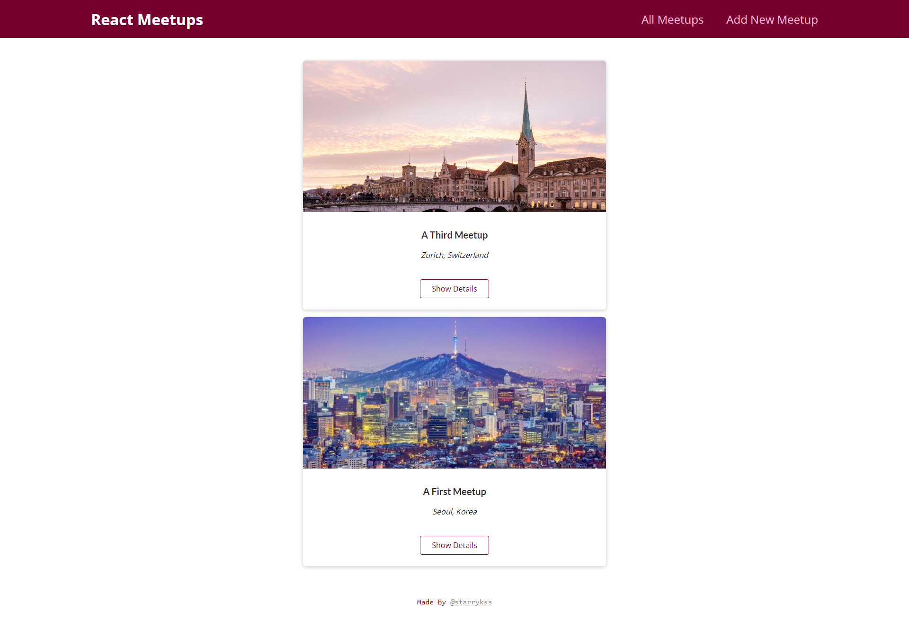

# React Meetups

## Description

- Next.js와 Page Router를 이용하여 만들어본 모임 관리 사이트
- Next.js를 이용하여 풀스택(Full Stack) 애플리케이션 형태로 제작
- MongoDB와의의 API 통신을 이용한 데이터 동기화 기능
- 기능
  - 모임 일정 확인 및 추가

## Development Information

- **Development Period** : 2024.08.09
- **Language** : HTML5, CSS3, JavaScript
- **Library** : React.js
- **Framework** : Next.js
- **Database** : MongoDB

## How to Start

> **yarn**

```bash
$ yarn dev
```

> **npm**

```bash
$ npm run dev
```

## Display

<table>
<tr>
  <th>Screenshot 1</th>
  <th>Screenshot 2</th>
</tr>
<tr>
  <td></td>
  <td></td>
</tr>
</table>
