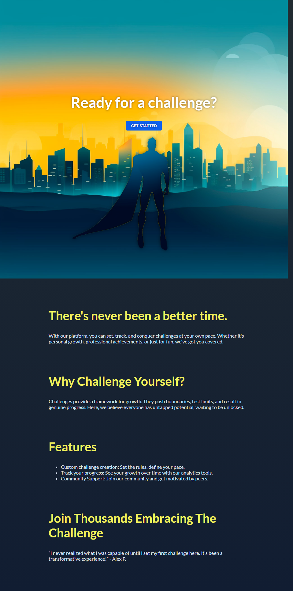
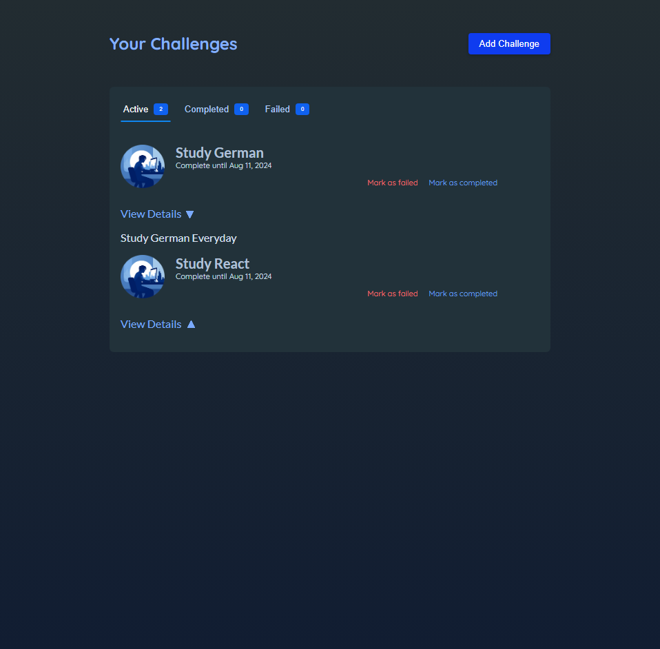

# React Challenges

## Description

- Framer Motion 라이브러리를 이용하여 애니메이션 효과를 적용하여 만들어본 목표 관리 사이트
- 기능
  - 목표 추가
  - 목표 상태 관리 (진행중, 실패, 성공)

## Development Information

- **Development Period** : 2024.08.11
- **Language** : HTML5, CSS3, JavaScript
- **Library** : React.js, Framer Motion

## How to Start

> **yarn**

```bash
$ yarn dev
```

> **npm**

```bash
$ npm run dev
```

## Display

<table>
<tr>
  <th>Screenshot 1</th>
  <th>Screenshot 2</th>
  <th>Screenshot 3</th>
</tr>
<tr>
  <td></td>
  <td></td>
  <td></td>
</tr>
</table>
