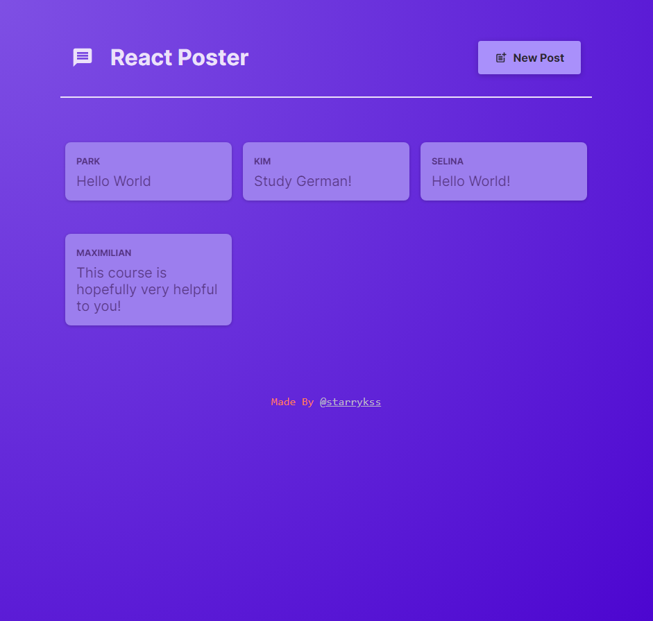
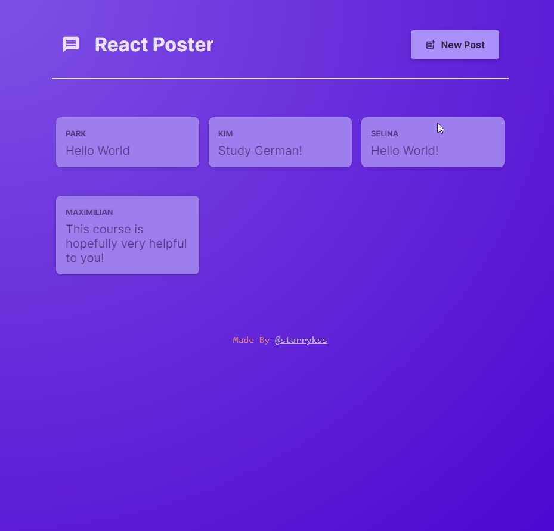

# React Poster

## Description

- 리액트의 종합적인 기능과 리액트 라우터(React Router)를 이용하여 만들어본 포스트 등록 사이트
  - 리액트 라우터 기능
    - 여러 경로를 감싸는 레이아웃을 설정하기 (중첩 라우트)
    - 데이터 가져오기와 전송하기
      - **로더(Loader)** 와 **액션(Action)** 을 사용하여 데이터를 가져오고 제출하기
      - `useFetcher`를 이용하여 페이지 이동 없이 데이터 가져오기
    - 동적 라우팅을 이용하여 각 포스트 페이지 이동하기(`/:postId`)
- 백엔드 서버와 프론트엔드 서버 사이의 통신 기능을 이용하여 포스트를 확인 및 추가할 수 있도록 구현
- 라우트를 이용하여 각각의 화면으로 이동 가능
  - 포스트 등록 화면(`/create-post`)
  - 포스트 세부 내용 화면(`/:postId`)

## Development Information

- **Development Period** : 2024.08.23
- **Language** : HTML5, CSS3, JavaScript
- **Library** : React.js, React Router

## How to Start

> **yarn**

- 백엔드 서버 켜기

```bash
$ cd backend
$ yarn
$ yarn dev
```

- 프론트엔드 서버 켜기

```bash
$ cd frontend
$ yarn
$ yarn dev
```

## Display

<table>
<tr>
  <th>Screenshot 1</th>
  <th>Screenshot 2</th>
</tr>
<tr>
  <td></td>
  <td></td>
</tr>
</table>
