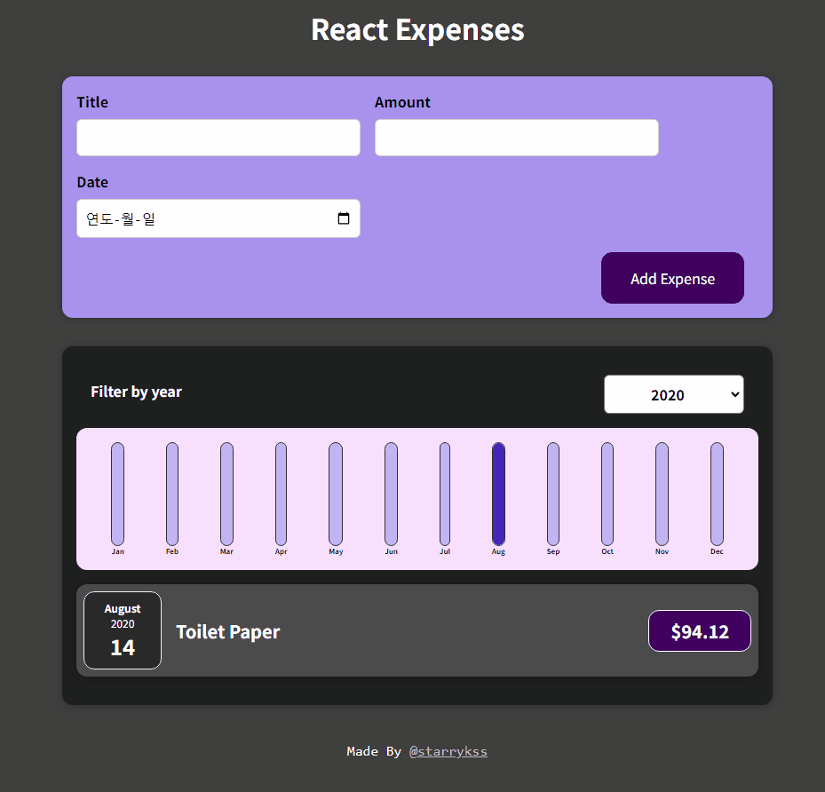

# React Expenses

## Description

- 리액트(React.js)의 기본적인 기능을 이용하여 만들어본 지출 기록 정리 사이트
- 기능
  - 지출 기록
  - 연도별 지출 기록 확인

## Development Information

- **Development Period** : 2024.08.25
- **Language** : HTML5, CSS3, JavaScript
- **Library** : React.js

## How to Start

> **yarn**

```bash
$ yarn
$ yarn start
```

> **npm**

```bash
$ npm install
$ npm run start
```

## Display

|              Screenshot 1              |              Screenshot 2              |
| :------------------------------------: | :------------------------------------: |
|  |  |
