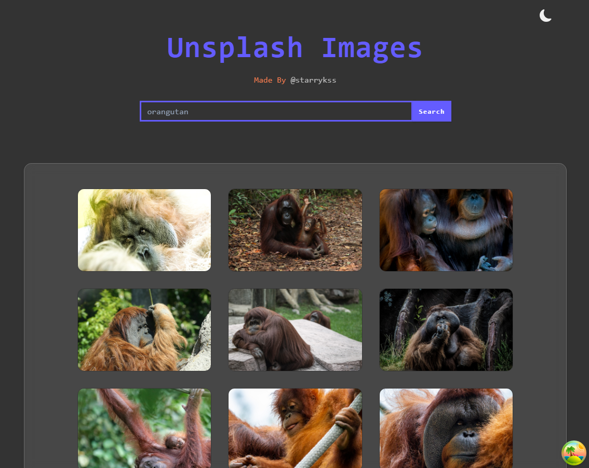

# Unsplash Images

## Description

- 리액트의 종합적인 기능과 Axios, React Query를 이용하여 구현한 이미지 검색 사이트
- Axios 라이브러리를 이용하여 외부 공개 API([Unsplash API](https://unsplash.com/developers))와의 통신을 통해 이미지 검색 기능 구현
- 검색창에 특정 문자를 검색하면, 해당 문자와 관련된 이미지가 표시된다.
  - React Router를 이용하여 검색 기능 구현
  - **무한 스크롤(Infinite Scroll)** 기능 적용 (`React Router`)
  - 이미지 로딩 시, **스켈레톤(Skeleton)** 효과 적용
- **Context API** 를 이용하여 라이트/다크 모드 토글 기능 구현
  - **Context API** 를 이용하여 구현
  - **로컬 스토리지(Local Storage)** 를 이용하여 테마 모드 적용 상태 저장 기능 구현
- 이미지에 마우스 커서 호버 시, 이미지 확대 효과 및 이미지 설명 표시

## Development Information

- **Development Period** : 2024.09.23
- **Language** : HTML5, CSS3, JavaScript
- **Library** : React.js, React Query, Axios

## How to Start

> [!NOTE]
>
> - 실행하기 위해서는 [Unsplash](https://unsplash.com/) 사이트 회원 가입(무료) 및 개인 API 키를 발급해야 한다.
> - 프로젝트 최상위 경로에 `.env` 파일을 생성 후, 다음과 같이 내용을 작성한다.
>   - `your_api_key`에 Unsplash에서 발급 받은 API 키를 넣는다.
>
> ```shell
> # /.env
> VITE_API_KEY=your_api_key
> ```

> **npm**

```bash
$ npm install
$ npm run dev
```

> **yarn**

```bash
$ yarn
$ yarn dev
```

## Display

<table>
<tr>
  <th>Screenshot 1</th>
  <th>Screenshot 2</th>
</tr>
<tr>
  <td></td>
  <td></td>
</tr>
</table>
