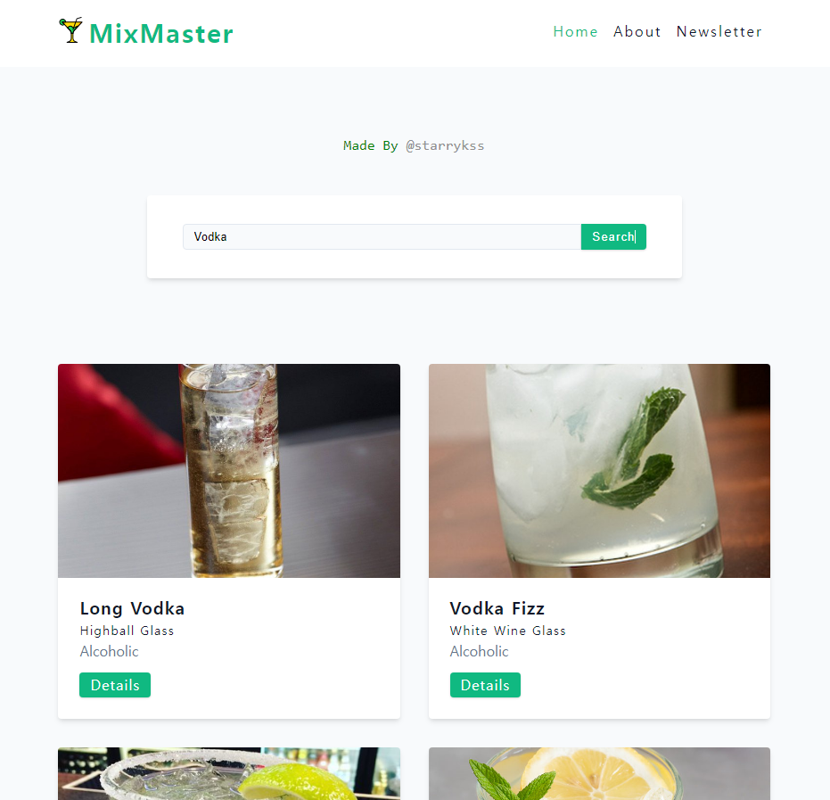

# MixMaster

## Description

- 리액트의 종합적인 기능과 Axios, React Router, React Query를 이용하여 구현한 칵테일 레시피 검색 사이트
- Axios 라이브러리를 이용하여 외부 공개 API([CocktailDB](https://www.thecocktaildb.com/))와의 통신을 통해 칵테일 레시피 검색 기능 구현
  - React Query를 이용하여 검색 결과 및 칵테일 레시피 세부 페이지 캐싱 기능 구현
- **FormData API** 를 이용하여 폼 처리 기능 구현
  - 뉴스레터 구독 기능 구현 (성/이름/이메일 정보 전송)
  - 외부 API로 `POST` 통신하는 방식
  - 이메일의 경우 `test@test.com`일 경우만 제출 가능
  - `React Toastify` 라이브러리를 이용하여, 폼 제출 후(API 호출 후) 응답 결과가 화면 상단에 표시되도록 구현
- 검색창에 특정 단어를 검색하면, 해당 단어와 관련된 칵테일 레시피 목록이 표시된다.
  - React Router를 이용하여 검색 기능 구현

## Development Information

- **Development Period** : 2024.09.25 - 2024.09.26
- **Language** : HTML5, CSS3, JavaScript
- **Library** : React.js, React Query, React Router, Axios, React Toastify

## How to Start

> **npm**

```bash
$ npm install
$ npm run dev
```

> **yarn**

```bash
$ yarn
$ yarn dev
```

## Display

<table>
<tr>
  <th>Screenshot 1</th>
  <th>Screenshot 2</th>
</tr>
<tr>
  <td></td>
  <td></td>
</tr>
</table>
