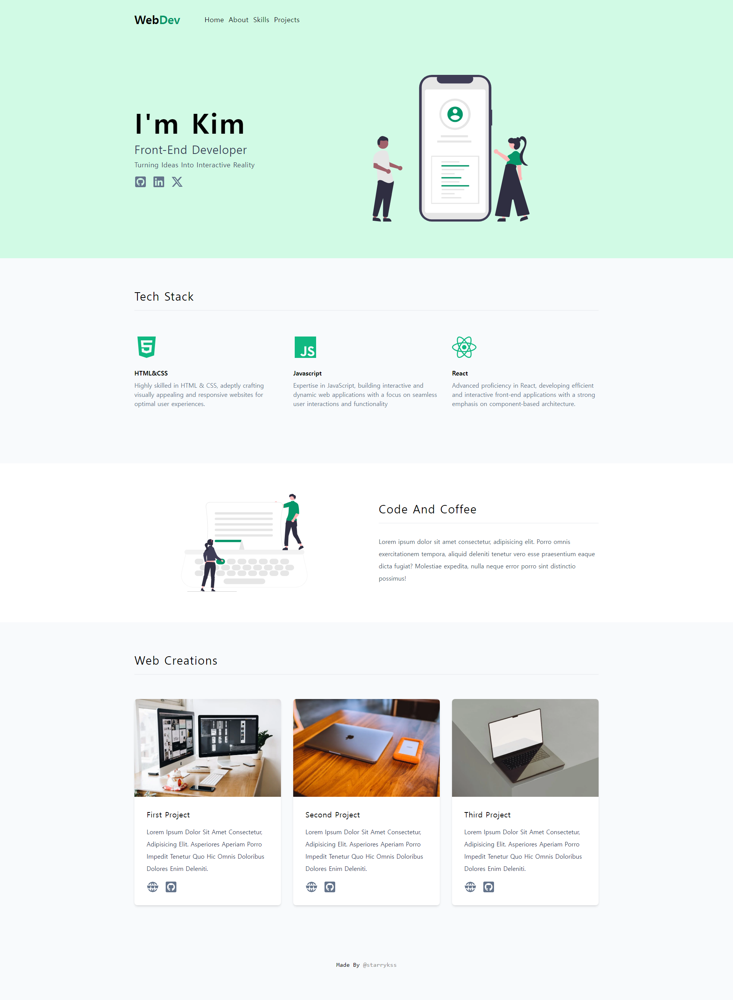

# WebDev Portfolio

## Description

- 리액트와 Tailwind CSS를 이용하여 만든 웹 포트폴리오 사이트
- 핵심적인 내용만 나타나도록 페이지를 심플하게 구성하였다.
- 화면의 크기에 따라 내부 레이아웃이 변화되도록 반응형 디자인을 적용하였다.

## Development Information

- **Development Period** : 2024.09.27
- **Language** : HTML5, CSS3, JavaScript
- **Library** : React.js, React Icons
- **Framework** : Tailwind CSS

## How to Start

> **npm**

```bash
$ npm install
$ npm run dev
```

> **yarn**

```bash
$ yarn
$ yarn dev
```

## Display

<table>
<tr>
  <th>Screenshot 1</th>
  <th>Screenshot 2</th>
</tr>
<tr>
  <td>
    
  </td>
  <td></td>
</tr>
</table>
