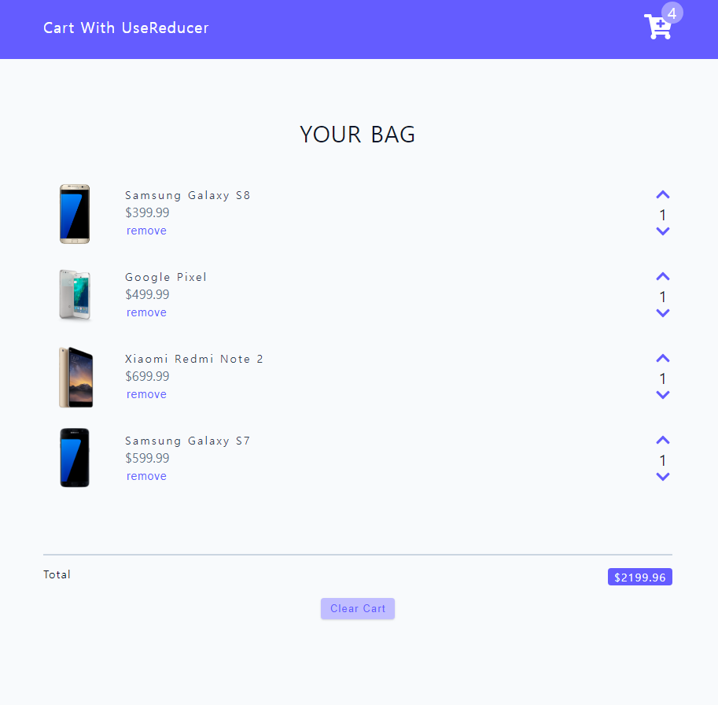
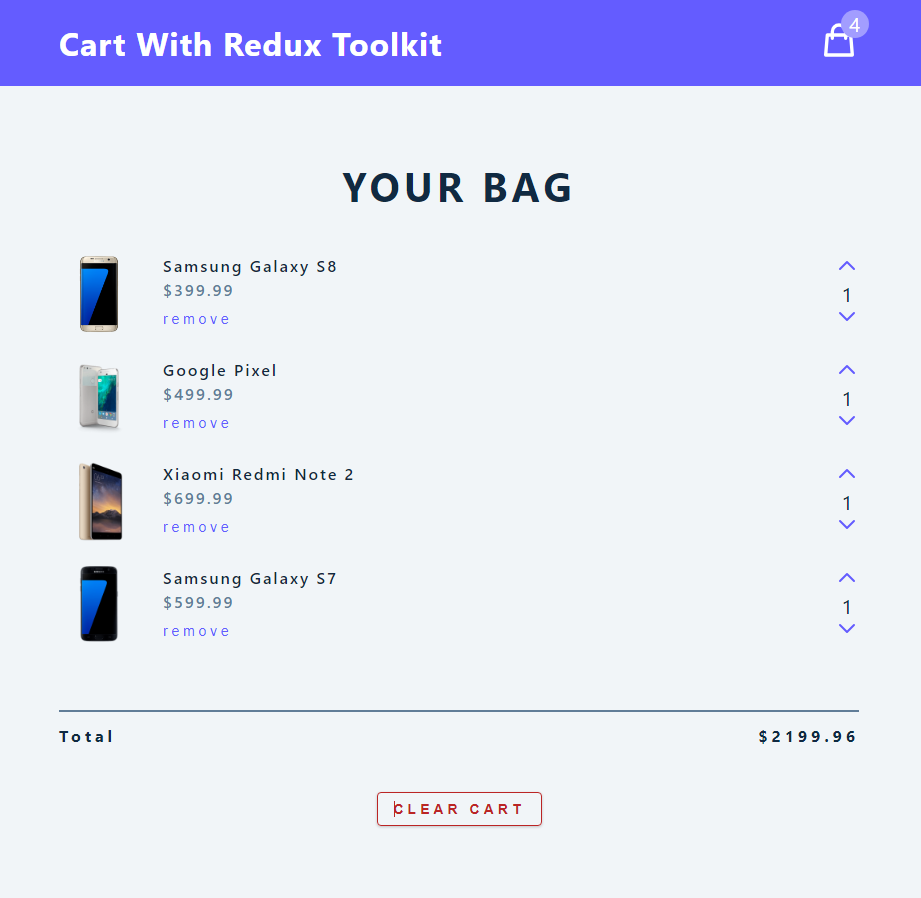
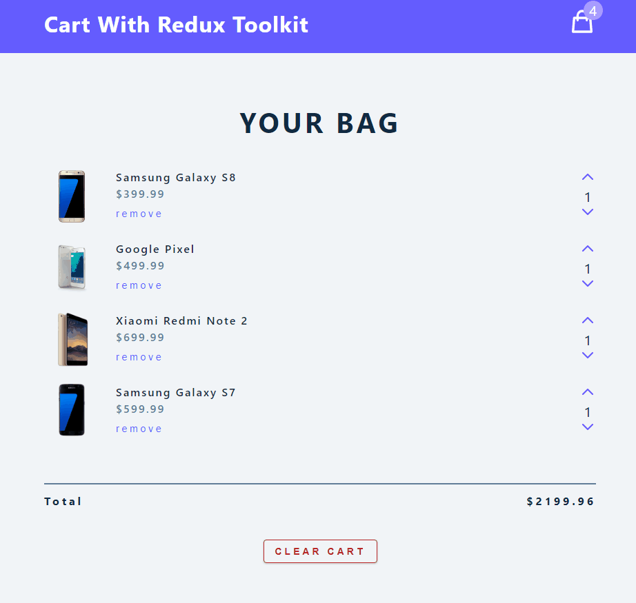

# Cart

## Description

- 리액트의 `useReducer`와 **Redux Toolkit** 을 이용하여 제작한 심플한 장바구니 사이트
- API 통신을 이용하여 데이터를 불러와서 표시하도록 하였다.
  - 프로젝트 폴더의 데이터 파일에서 데이터를 불러와서 표시하는 기능 또한 구현하였다.
  - 데이터가 불러와지는 동안 로딩 스피너(Loading Spinner)가 표시되도록 하였다.
- 장바구니 상품 항목 추가/삭제/전체 삭제 기능을 구현하였다.
- <ins>2가지</ins> 버전으로 제작하였다.
  - `usereducer-version`
    - `useReducer` 훅을 이용하여 제작한 페이지
  - `redux-toolkit-version`
    - Redux Toolkit을 이용하여 제작한 페이지
    - 모달(Modal) 창 표시 기능
    - 디자인 개선

## Development Information

- **Development Period** : 2024.09.16, 2024.09.28
- **Language** : HTML5, CSS3, JavaScript
- **Library** : React.js, Redux Toolkit

## How to Start

> **npm**

```bash
$ npm install
$ npm run dev
```

> **yarn**

```bash
$ yarn
$ yarn dev
```

## Display

<table>
<tr>
  <th>Screenshot 1</th>
  <th>Screenshot 2</th>
  <th>Screenshot 3</th>
</tr>
<tr>
  <td>
    
  </td>
  <td>
    
  </td>
  <td>
  
  </td>
</tr>
</table>
