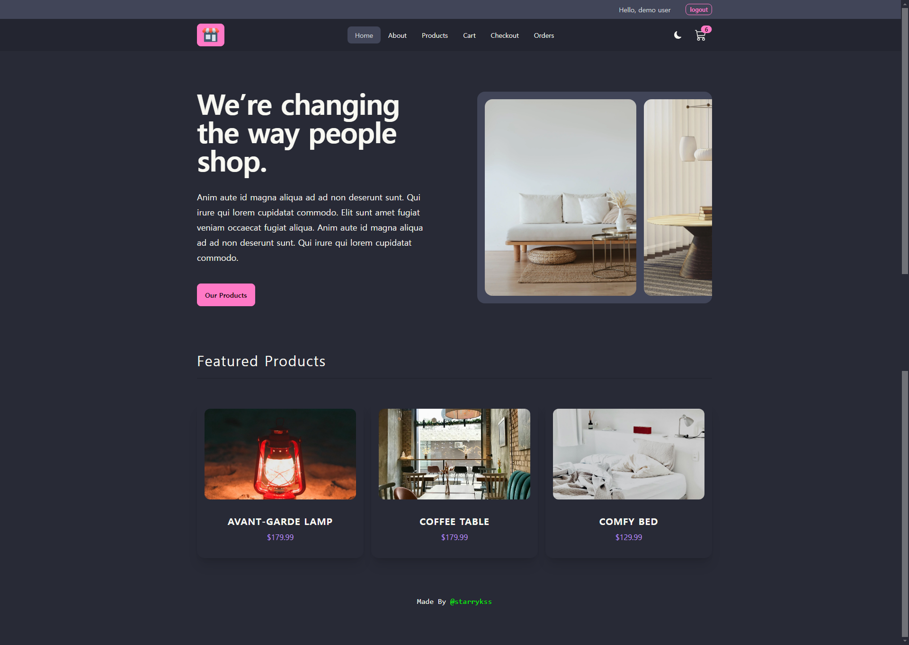

# Comfy Store

## Description

- 리액트의 종합적인 기능과 Axios, React Router, Redux Toolkit, React Query를 이용하여 구현한 쇼핑몰 사이트
- 다음과 같이 페이지를 구성하였다.
  - `/home` : 랜딩 페이지
  - `/about` : 페이지 소개 페이지
  - `/products` : 상품 목록 페이지
    - 상품 항목 클릭 시, 각 상품별 페이지(`/products/:id`)로 이동 가능
      - 개별 상품 페이지(`/products/:id`)에서 수량, 색상을 선택 후 장바구니 추가 가능
    - 조건에 따라 상품 검색 가능
      - 검색 조건들이 URL 쿼리 파라미터로 입력되도록 구현
      - API 요청을 통해 검색 후 응답 결과를 가져와 페이지에 표시
  - `/cart` : 장바구니 페이지
    - 상품 삭제 가능
    - 수량 조절 가능
    - 주문 버튼 추가하여 바로 주문 가능
  - `/checkout` : 상품 주문 페이지
    - 장바구니에 추가한 상품을 주문하는 페이지
    - 배송 정보(이름과 주소)를 입력해야 주문 가능
    - API 요청을 통해 주문 정보 서버로 전송
  - `/orders` : 주문 정보 확인 페이지
    - API 요청한 주문 정보를 목록 형태로 볼 수 있는 페이지
  - `/login` : 로그인 페이지
    - <ins>2가지</ins> 방법으로 로그인 가능
      - **게스트 유저 로그인**
        - 데모 계정(`test@test.com`)으로 로그인
        - 모든 기능 이용 기능
      - **일반 로그인**
        - 회원 가입한 계정으로 로그인
        - 모든 기능 이용 가능
    - 로그인 계정이 없을 경우, 회원가입(`/register`) 페이지로 이동하여 회원가입 가능
  - `/register` : 회원가입 페이지
    - API 요청을 통해 회원가입 진행
    - 이미 서버에 계정명(USERNAME) 또는 이메일(EMAIL)이 존재하는 경우 회원가입 불가
- Axios 라이브러리를 이용한 API 통신을 이용하여 여러가지 기능을 구현하였다.
  - 회원가입 및 로그인/로그아웃
  - 상품 목록 가져오기
  - 상품 정보 가져오기
  - 구매 요청하기
  - 구매 목록 가져오기
- 전역 상태 관리 라이브러리(Redux Toolkit)를 이용하여 로그인 여부, 장바구니 정보 등이 전역 상태로 관리되도록 하였다.
- Tailwind CSS의 컴포넌트 라이브러리인 daisyUI를 이용하여 스타일시트 파일을 만들지 않고 스타일을 적용하였다.
  - **다크/라이트 모드** 토글 기능 구현
  - 반응형 페이지 구현
- 로컬 스토리지를 이용하여 로그인 정보, 테마 정보, 장바구니 상품 정보 등이 저장되도록 하였다.

## Development Information

- **Development Period** : 2024.09.30 - 2024.10.03
- **Language** : HTML5, CSS3, JavaScript
- **Library** : React.js, Redux Toolkit, React Query, React Router, React Toastify, daisyUI, Axios, dayJS
- **Framework** : Tailwind CSS

## How to Start

> **npm**

```bash
$ npm install
$ npm run dev
```

> **yarn**

```bash
$ yarn
$ yarn dev
```

## Display

<table>
<tr>
  <th>Screenshot 1</th>
  <th>Screenshot 2</th>
</tr>
<tr>
  <td>
    
  </td>
  <td>
    
  </td>
</tr>
</table>
