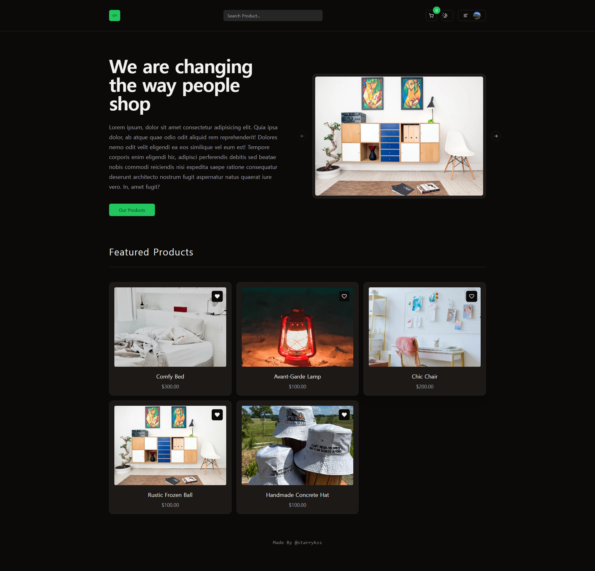
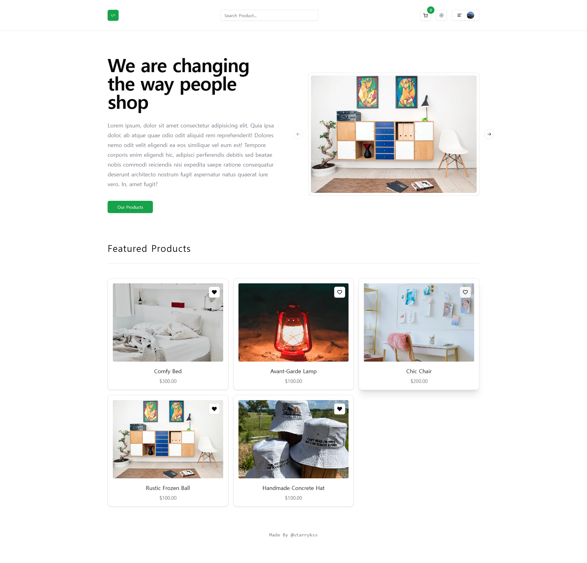

# Next Store

## Description

- Next.js와 TypeScript를 이용하여 <ins>풀스택</ins>으로 구현한 쇼핑몰 사이트
- Tailwind CSS 기반의 `shadcn/ui` 라이브러리를 이용하여 UI 구성
- [Supabase](https://supabase.com/), [Prisma](https://www.prisma.io/)를 이용하여 DB 구성
  - ORM 도구인 Prisma를 이용하여 Supabase와 연동하여 DB 처리
    - 상품 정보
    - 주문 정보
    - 상품 리뷰, 상품 평점
- [Clerk](https://www.clerk.com/)를 이용하여 인증(Authentication) 기능 구현
  - 회원가입 (이메일, 소셜 계정)
  - 로그인, 로그아웃
- 관리자(Admin) 페이지 구현 (`/admin`)
  - 전체 사용자의 상품 판매 기록 조회 (`/admin/sales`)
  - 새로운 상품 등록 (`/admin/products/create`)
  - 페이지에 등록된 전체 상품 정보 확인/수정/삭제 (`/admin/products`)
- [Zod](https://zod.dev/) 라이브러리를 이용하여 타입 검증과 스키마 유효성 검사 수행
- [React Share](https://www.npmjs.com/package/react-share) 라이브러리를 이용하여 상품 페이지 공유 기능 구현
- [Stripe](https://stripe.com/)를 이용하여 결제 기능 구현
- 각 상품 페이지에서 실행 가능한 여러 가지 기능 구현
  - 장바구니에 상품 추가하기
  - 공유하기
    - `React Share` 라이브러리를 이용하여 구현
  - 평점과 함께 리뷰 남기기
  - 즐겨찾기(Favorite) 상품 설정하기
- 다크/라이트 모드 기능 구현
- 상품 검색 기능 구현
- 로딩 화면 중, 스켈레톤(Skeleton) 표시 기능 구현

## Routes

- `/` : 홈 화면
- `/about` : 페이지 소개
- `/products` : 상품 목록
  - `/products/:id` : 각 상품 별 페이지
- `/favorites` : 즐겨찾기한 상품 목록
- `/reviews` : 내가 작성한 상품 리뷰 모아 보기 및 삭제 가능
- `/cart` : 장바구니
- `/orders` : 주문 내역
- `/admin` : 관리자 페이지 (관리자로 설정된 계정만 진입 가능)
  - `/admin/sales` : 전체 사용자의 상품 판매 기록 조회
  - `/admin/products/create` : 새로운 상품 등록
  - `/admin/products` : 페이지에 등록된 전체 상품 정보 확인/수정/삭제

## Development Information

- **Development Period** : 2024.10.20 - 2024.11.02
- **Language** : HTML5, CSS3, JavaScript, TypeScript
- **Library** : React.js, Axios, Zod, React Share, Faker.js
- **Framework** : Next.js, Tailwind CSS
- **Service** : Prisma, Supabase, Clerk, Stripe
- **Etc** : use-debounce, shadcn/ui

## How to Start

> [!NOTE]
>
> - 실행하기 위해서는 [Supabase](https://supabase.com/), [Clerk](https://www.clerk.com/), [Stripe](https://stripe.com/) 사이트 회원 가입(무료) 및 개인 API 키를 발급해야 한다.
> - 프로젝트 최상위 경로에 `.env`, `.env.local` 파일을 생성한 후, 아래의 키에 맞는 값들을 넣어준다.
>
> ```shell
> # /.env
> # Supabase 연동 관련
> DATABASE_URL=
> DIRECT_URL=
>
> SUPABASE_URL=
> SUPABASE_KEY=
> NEXT_PUBLIC_WEBSITE_URL=
>
> # Stripe 관련
> NEXT_PUBLIC_STRIPE_PUBLISHABLE_KEY=
> STRIPE_SECRET_KEY=
> ```
>
> ```shell
> # /.env.local
> # CLERK 연동 관련
> NEXT_PUBLIC_CLERK_PUBLISHABLE_KEY=
> CLERK_SECRET_KEY=
>
> # 관리자 사용자 ID
> ADMIN_USER_ID=
> ```

> **npm**

```bash
$ npm install
$ npm run dev
```

> **yarn**

```bash
$ yarn
$ yarn dev
```

## Display

<table>
<tr>
  <th>Screenshot 1</th>
  <th>Screenshot 2</th>
</tr>
<tr>
  <td>
    
  </td>
  <td>
    
  </td>
</tr>
<tr>
  <th colspan="2">Screenshot 3</th>
</tr>
<tr>
  <td colspan="2">
    
  </td>
</tr>
</table>
