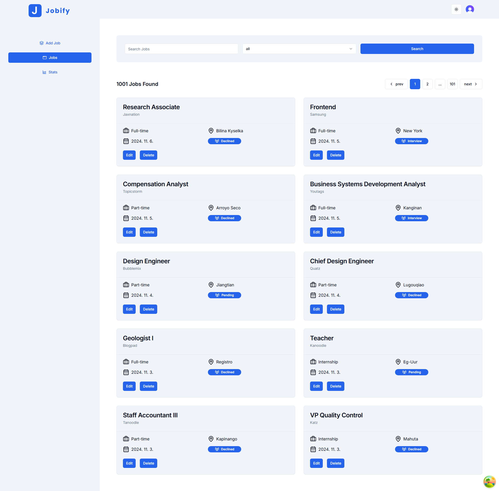
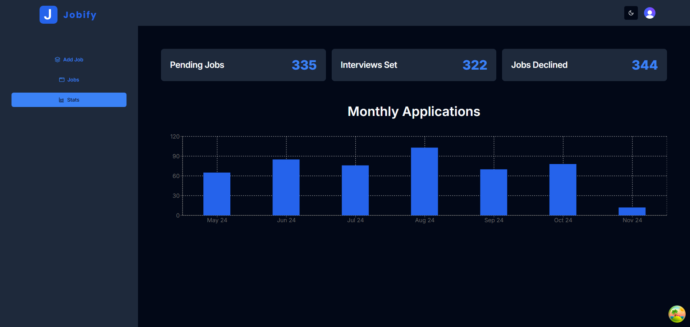
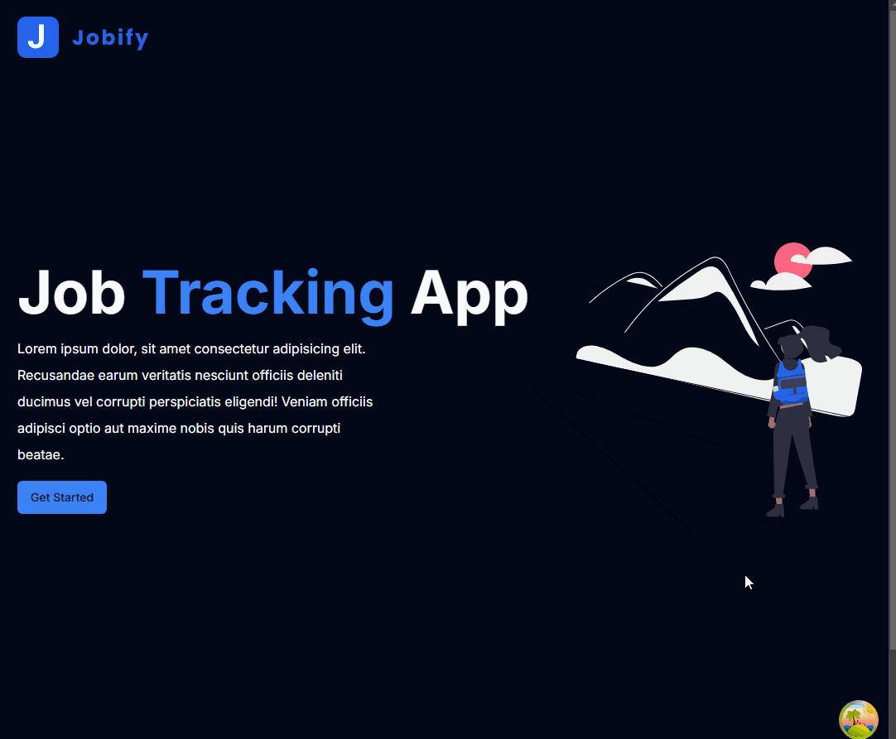

# Jobify

## Description

- Next.js와 TypeScript를 이용하여 <ins>풀스택</ins>으로 구현한 입사 지원 기록 사이트
  - 서비스를 이용하기 위해서는 회원가입을 통해 로그인을 해야 한다.
  - 자신이 입사한 구직 공고의 여러가지 정보를 입력하여 등록할 수 있다.
    - 포지션(`Position`)
    - 회사 이름(`Company`)
    - 회사 위치(`Location`)
    - 구직 상태(`Job Status`)
    - 고용 형태(`Job Mode`)
  - 언제든지 등록한 입사 지원 기록을 수정하거나 삭제할 수 있다.
  - 전체 지원 횟수를 월 단위로 차트를 통해 확인할 수 있다.
- Tailwind CSS 기반의 `shadcn/ui` 라이브러리를 이용하여 UI 구성
- [Render](https://render.com/), [Prisma](https://www.prisma.io/)를 이용하여 DB 구성
  - ORM 도구인 Prisma를 이용하여 Render와 연동하여 DB 처리
    - 입사 지원 정보
- [Clerk](https://www.clerk.com/)를 이용하여 인증(Authentication) 기능 구현
  - 회원가입 (이메일, 소셜 계정)
  - 로그인, 로그아웃
- 페이지에 등록된 입사 지원 정보 확인/수정/삭제 및 검색 기능 구현
- [Zod](https://zod.dev/) 라이브러리를 이용하여 타입 검증과 스키마 유효성 검사 수행
- [Mockaroo](https://www.mockaroo.com/)를 이용하여 가상 데이터 1,000개 생성 및 추가
- [Recharts](https://recharts.org/) 라이브러리를 이용하여 차트 기능 구현
- 다크/라이트 모드 기능 구현
- 로딩 화면 중, 스켈레톤(Skeleton) 표시 기능 구현
- 반응형 디자인 적용
  - 화면 크기가 특정 기준 이하로 줄어들 경우, 사이드바를 숨기고, 상단의 네비게이션바에 메뉴 아이콘 버튼 표시

## Routes

- `/` : 홈 화면
- `/add-job` : 입사 지원 기록 등록 페이지
- `/jobs` : 입사 지원 기록 확인 페이지 (각 입사 지원 기록 항목 검색/수정/삭제 가능)
- `/stats` : 월 별로 등록된 입사 지원 기록 개수 확인 페이지

## Development Information

- **Development Period** : 2024.11.04 - 2024.11.06
- **Language** : HTML5, CSS3, JavaScript, TypeScript
- **Library** : React.js, Zod, Recharts
- **Framework** : Next.js, Tailwind CSS
- **Service** : Prisma, Render, Clerk, Mockaroo
- **Etc** : shadcn/ui

## How to Start

> [!NOTE]
>
> - 실행하기 위해서는 [Render](https://render.com/), [Clerk](https://www.clerk.com/) 사이트 회원 가입(무료) 및 개인 API 키를 발급해야 한다.
> - 프로젝트 최상위 경로에 `.env`, `.env.local` 파일을 생성한 후, 아래의 키에 맞는 값들을 넣어준다.
>
> ```shell
> # /.env
> # Render 연동 관련
> DATABASE_URL=
> ```
>
> ```shell
> # /.env.local
> # CLERK 연동 관련
> NEXT_PUBLIC_CLERK_PUBLISHABLE_KEY=
> CLERK_SECRET_KEY=
> ```

> **npm**

```bash
$ npm install
$ npm run dev
```

> **yarn**

```bash
$ yarn
$ yarn dev
```

## Display

<table>
<tr>
  <th>Screenshot 1</th>
  <th>Screenshot 2</th>
</tr>
<tr>
  <td>
    
  </td>
  <td>
    
  </td>
</tr>
<tr>
  <th colspan="2">Screenshot 3</th>
</tr>
<tr>
  <td colspan="2">
    
  </td>
</tr>
</table>
