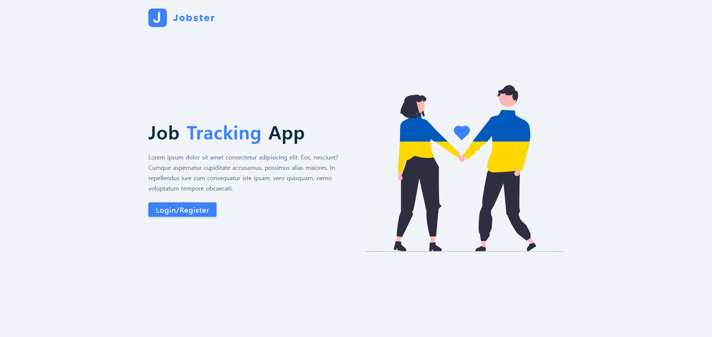
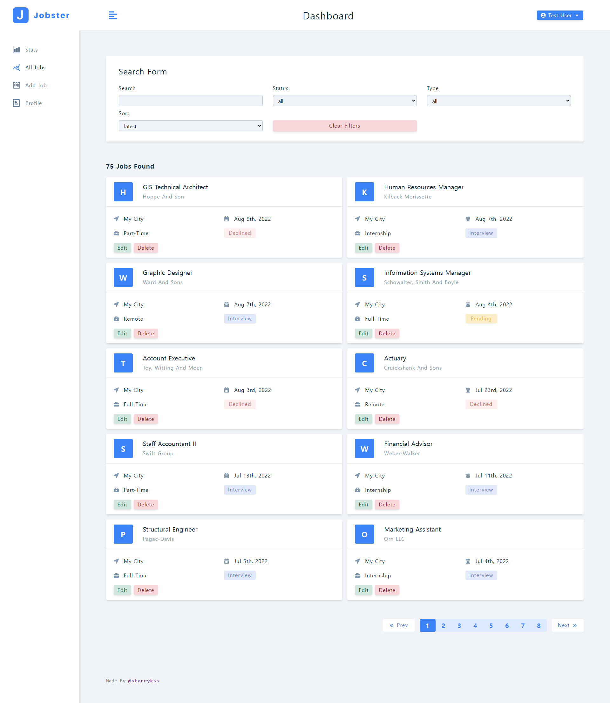
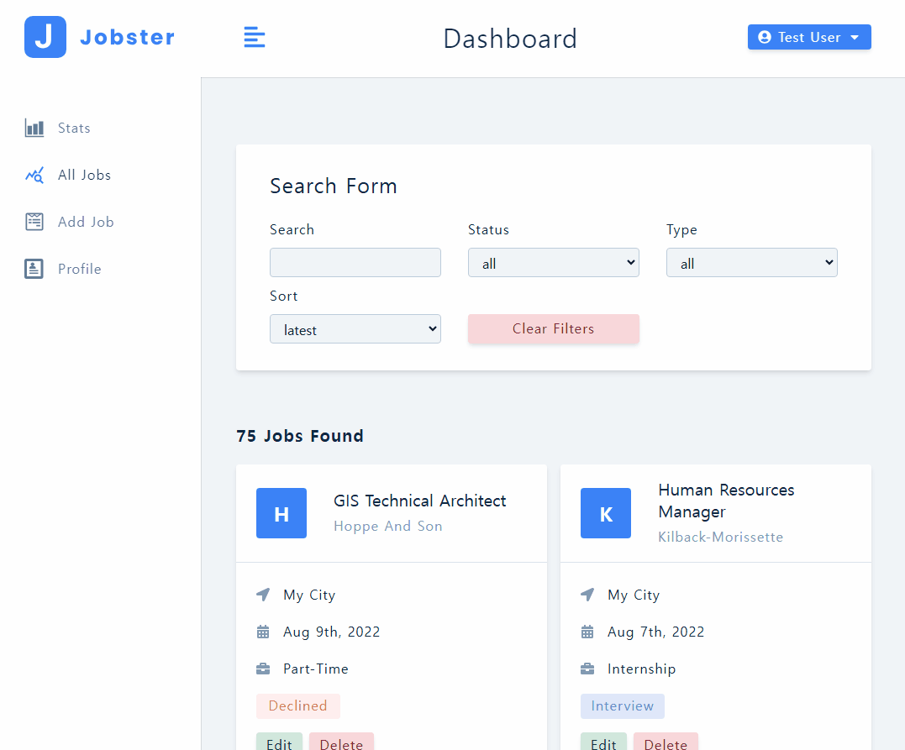

# Jobster

## Description

- `project-40`(Jobify) 프로젝트를 React.js와 JavaScript, Redux-Toolkit, React Router, Styled-Components을 이용하여 구현한 입사 지원 기록 사이트
  - 서비스를 이용하기 위해서는 회원가입을 통해 로그인하거나 테스트(데모) 계정으로 로그인 해야 한다.
    - 테스트 계정으로 로그인하기 위해서는 `/register` 화면에서 `[Demo]` 버튼을 클릭한다.
      - 입사 지원 기록 추가/수정/삭제 <ins>불가</ins> (읽기 전용)
  - 자신이 입사한 입사 지원 기록의 여러가지 정보를 입력하여 등록할 수 있다.
    - 포지션(`Position`)
    - 회사 이름(`Company`)
    - 회사 위치(`Location`)
    - 구직 상태(`Job Status`)
    - 고용 형태(`Job Mode`)
  - 언제든지 등록한 입사 지원 기록을 수정하거나 삭제할 수 있다.
  - 전체 지원 횟수를 월 단위로 차트를 통해 확인할 수 있다.
  - 페이지에 등록된 입사 지원 정보 확인/수정/삭제할 수 있다.
  - 등록된 입사 지원 정보 검색할 수 있다.
  - 회원가입한 계정의 정보를 수정할 수 있다.
- [`normalize.css`](https://necolas.github.io/normalize.css/)를 사용하여 Chrome, Safari, Firefox 등 다양한 브라우저에서 HTML 요소의 스타일이 일관되게 보여지도록 설정
- [moment.js](https://momentjs.com/) 라이브러리를 이용하여 날짜 및 시간 표시 기능 구현
- [Recharts](https://recharts.org/) 라이브러리를 이용하여 차트 기능 구현
  - 막대 차트(Bar Chart)
  - 영역 차트(Area Chart)
- [React Toastify](https://www.npmjs.com/package/react-toastify) 라이브러리를 이용하여 토스트 메시지 표시 기능 구현
- [React Icons](https://react-icons.github.io/react-icons/) 라이브러리를 이용하여 화면에 보여지는 아이콘 구성
- Axios 라이브러리를 이용하여 API 통신 기능 구현
  - 회원가입/로그인/로그아웃
  - 입사 지원 기록 추가/수정/삭제/검색
  - 계정 정보 수정
  - 입사 지원 기록 관련 통계 정보(`stats`) 가져오기
    - 월 별 입사 지원 기록 총개수
    - 구직 상태 별 입사 지원 기록 총개수
- 페이지네이션(Pagination) 기능 구현 (`/all-jobs`)
- 디바운스(Debounce) 기능을 직접 구현하여 검색 기능에 적용
- 반응형 디자인 적용
  - 화면 크기에 따라 사이드바 표시 방법이 달라지도록 구현

## Routes

- `/` : 홈 화면
- `/add-job` : 입사 지원 기록 등록/수정 페이지
- `/jobs` : 입사 지원 기록 확인 페이지 (각 입사 지원 기록 항목 검색/수정/삭제 가능)
- `/stats` : 월 별로 등록된 입사 지원 기록 개수 확인 페이지
- `/profile` : 계정 정보 확인 페이지 (수정 가능)
- `/register` : 회원가입, 로그인 페이지

## Development Information

- **Development Period** : 2024.11.07 - 2024.11.15
- **Language** : HTML5, CSS3, JavaScript
- **Library** : React.js, Recharts, Axios, React Toastify, React Icons

## How to Start

> **npm**

```bash
$ npm install
$ npm run dev
```

> **yarn**

```bash
$ yarn
$ yarn dev
```

## Display

<table>
<tr>
  <th>Screenshot 1</th>
</tr>
<tr>
  <td>
    
  </td>
</tr>
<tr>
  <th>Screenshot 2</th>
</tr>
<tr>
  <td>
    
  </td>
</tr>
<tr>
  <th>Screenshot 3</th>
</tr>
<tr>
  <td>
    
  </td>
</tr>
<tr>
  <th>Screenshot 4</th>
</tr>
<tr>
  <td>
    
    <span><i>※ 입사 지원 기록 검색 및 차트 형태 변경</i></p>
  </td>
</tr>
</table>
