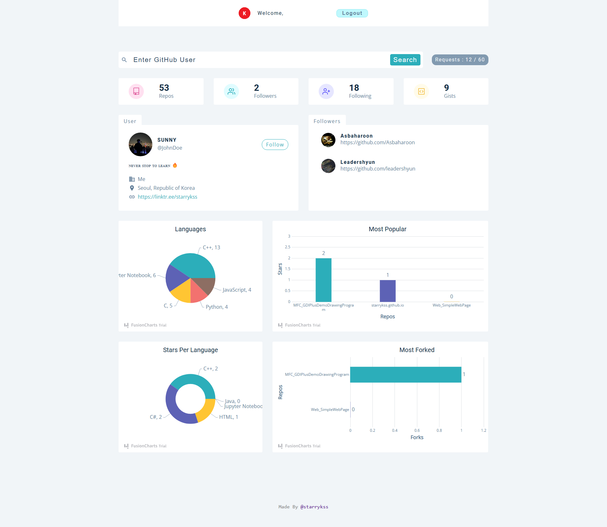

# GitHub Users

## Description

- React.js와 Styled-Components를 이용하여 구현한 GitHub 사용자 검색 사이트
  - [GitHub API](https://docs.github.com/ko/rest)를 이용하여 GitHub 사용자의 정보를 확인할 수 있는 기능을 구현하였다.
    - 레포지토리 수, 팔로워 수
    - 팔로잉 수
    - Gist 수
    - 사용자 프로필 정보
    - 팔로워 정보
    - 사용 언어 비율
    - 인기 레포지토리 (Star)
    - 인기 레포지토리 (Fork)
    - 언어 별 Star 수
  - GitHub API 정책 상, 동일한 IP에서 <ins>1시간에 60번</ins>의 API 호출만 가능
- Styled-Components를 이용하여 하나의 컴포넌트 파일에 구조와 스타일이 모두 포함되도록 파일 구성
- React Router를 이용하여 라우팅 기능 구현
- Context API를 이용하여 전역 상태 관리 기능 구현
- [Auth0](https://auth0.com/)를 이용하여 인증(Authentication) 기능 구현
- [FusionCharts](https://www.fusioncharts.com/) 라이브러리를 이용하여 GitHub 계정 통계 정보가 차트에 표시되도록 구현

## Routes

- `/` : 홈 화면 (대시보드)
- `/login` : 로그인 페이지

## Development Information

- **Development Period** : 2024.11.18 - 2024.11.20
- **Language** : HTML5, CSS3, JavaScript
- **Library** : React.js, Axios, Styled-Components, FusionCharts
- **Service** : Auth0

## How to Start

> [!NOTE]
>
> - 실행하기 위해서는 [Auth0](https://auth0.com/) 사이트 회원 가입(무료) 및 개인 API 키를 발급해야 한다.
> - 프로젝트 최상위 경로에 `.env` 파일을 생성한 후, 아래의 키에 맞는 값들을 넣어준다.
>
> ```shell
> # /.env
> # Auth0 연동 관련
> VITE_DOMAIN=
> VITE_CLIENT_ID=
> ```

> **npm**

```bash
$ npm install
$ npm run dev
```

> **yarn**

```bash
$ yarn
$ yarn dev
```

## Display

<table>
<tr>
  <th>Screenshot 1</th>
</tr>
<tr>
  <td>
    
  </td>
</tr>
<tr>
  <th>Screenshot 2</th>
</tr>
<tr>
  <td>
    
  </td>
</tr>
</table>
