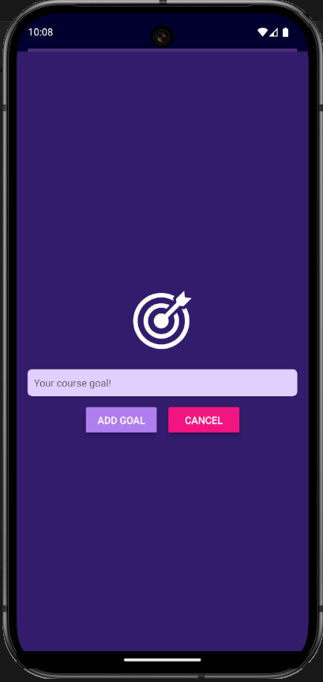
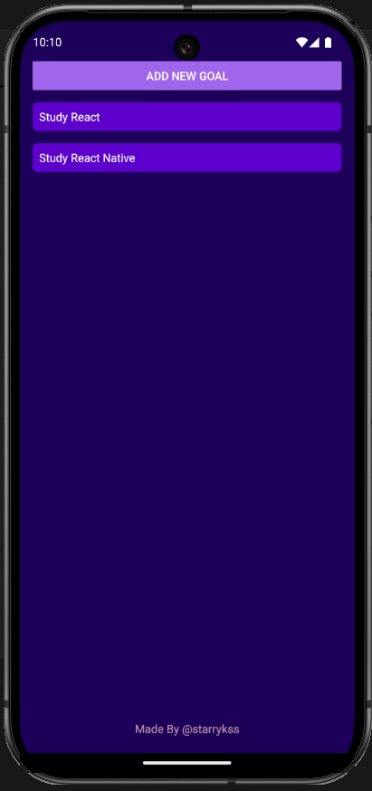

# Course Goal List

## Description

- React Native를 이용하여 제작한 수업 목표 등록 앱
- `FlatList` 컴포넌트를 이용하여 대량의 데이터들이 효율적으로 처리되도록 설정
- 기능
  - 수업 목표 추가
  - 수업 목표 삭제
    - 수업 목표 항목 클릭 시 삭제

## Development Information

- **Development Period** : 2024.12.11 - 2024.12.11
- **Language** : HTML5, CSS3, JavaScript
- **Library** : React.js
- **Framework** : React Native

## How to Start

> **npm**

```bash
$ npm install
$ npm start
```

> **yarn**

```bash
$ yarn
$ yarn start
```

- 터미널에 위의 명령을 실행한 후,
  - Android 에뮬레이터가 설치되어 있을 경우, `a` 버튼 클릭
  - 웹에서 실행하려면, `w` 버튼 클릭

```text
› Press a │ open Android
› Press w │ open web
```

## Display

<table>
<tr>
  <th colspan="3">Screenshots</th>
</tr>
<tr>
  <td>
    
  </td>
  <td>
    
  </td>
  <td>
    
  </td>
</tr>
</table>
