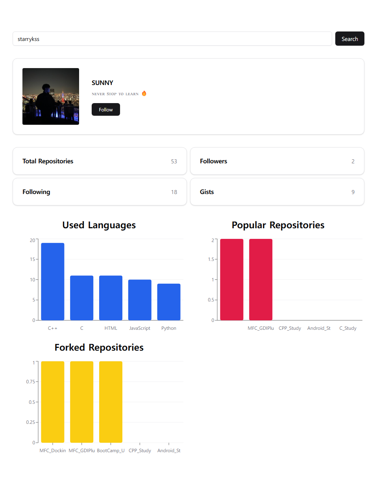
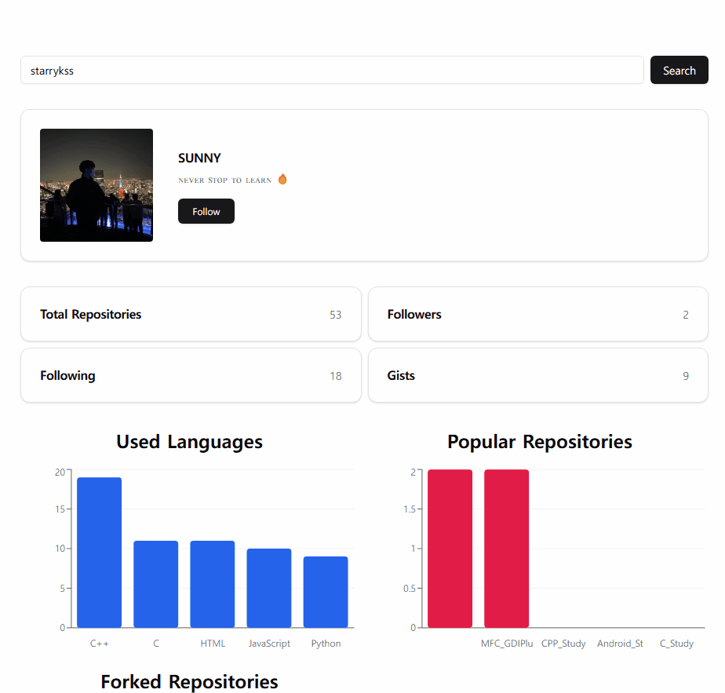

# GitHub Users with GraphQL

## Description

- GitHub GraphQL API를 이용하여 React, TypeScript, GraphQL, Tailwind CSS로 구현한 GitHub 사용자 검색 사이트
  - [GitHub GraphQL API](https://docs.github.com/en/graphql/overview/explorer)를 이용하여 GitHub 사용자의 정보를 검색하고 확인할 수 있는 기능을 구현하였다.
    - 레포지토리 수, 팔로워 수
    - 팔로잉 수
    - Gist 수
    - 사용자 프로필 정보
    - 팔로워 정보
    - 사용 언어 비율
    - 인기 레포지토리 (Star)
    - 인기 레포지토리 (Fork)
    - 언어 별 Star 수
  - GitHub API 정책 상, 동일한 IP에서 <ins>1시간에 60번</ins>의 API 호출만 가능
- Tailwind CSS 기반의 `shadcn/ui` 라이브러리를 이용하여 UI 구성
- Apollo Client를 이용하여 GraphQL 관련 기능 처리
- `recharts` 라이브러리를 이용하여 차트 정보 표현

## Development Information

- **Development Period** : 2025.01.26 - 2025.01.26
- **Language** : HTML5, CSS3, TypeScript
- **Library** : React, Apollo Client, recharts
- **Framework** : Tailwind CSS
- **Etc** : shadcn/ui

## How to Start

> [!NOTE]
>
> - 실행하기 위해서는 [GitHub](https://github.com/) 개인 토큰을 발급해야 한다.
> - 프로젝트 최상위 경로에 `.env.local` 파일을 생성한 후, 아래의 키에 맞는 값들을 넣어준다.
>
> ```shell
> VITE_GITHUB_TOKEN=
> ```

> **npm**

```bash
$ npm install
$ npm run dev
```

> **yarn**

```bash
$ yarn
$ yarn dev
```

## Display

<table>
<tr>
  <th>Screenshot 1</th>
  <th>Screenshot 2</th>
</tr>
<tr>
  <td>
    
  </td>
  <td>
    
  </td>
</tr>
</table>
